House Prices: EDA and Data Cleansing
================
David Jesse
17 August 2020

``` r
# !diagnostics off
```

``` r
# turn off scientific notation
options(scipen=999)
```

0. Start
========

``` r
# working directory
setwd(working_directory)
```

``` r
# basic packages for data wrangling and preprocessing
library(tidyverse)
```

    ## -- Attaching packages ------------------------------------------------ tidyverse 1.3.0 --

    ## v ggplot2 3.3.2     v purrr   0.3.4
    ## v tibble  3.0.3     v dplyr   1.0.2
    ## v tidyr   1.1.1     v stringr 1.4.0
    ## v readr   1.3.1     v forcats 0.5.0

    ## -- Conflicts --------------------------------------------------- tidyverse_conflicts() --
    ## x dplyr::filter() masks stats::filter()
    ## x dplyr::lag()    masks stats::lag()

``` r
library(fastDummies)
library(caTools)

# use numeric instead of scientific notation of values in plots
library(scales)
```

    ## 
    ## Attaching package: 'scales'

    ## The following object is masked from 'package:purrr':
    ## 
    ##     discard

    ## The following object is masked from 'package:readr':
    ## 
    ##     col_factor

``` r
# additional packages for visualization
library(gridExtra)
```

    ## 
    ## Attaching package: 'gridExtra'

    ## The following object is masked from 'package:dplyr':
    ## 
    ##     combine

``` r
library(corrplot)
```

    ## corrplot 0.84 loaded

``` r
library(gg3D)
library(plot3D)

# data analysis and transformation
library(moments)
library(rcompanion)

# evaluation metrics
library(Metrics)
```

    ## 
    ## Attaching package: 'Metrics'

    ## The following object is masked from 'package:rcompanion':
    ## 
    ##     accuracy

``` r
# nice looking regression outputs
library(texreg)
```

    ## Version:  1.37.5
    ## Date:     2020-06-17
    ## Author:   Philip Leifeld (University of Essex)
    ## 
    ## Consider submitting praise using the praise or praise_interactive functions.
    ## Please cite the JSS article in your publications -- see citation("texreg").

    ## 
    ## Attaching package: 'texreg'

    ## The following object is masked from 'package:tidyr':
    ## 
    ##     extract

``` r
# different models
library(tidymodels)
```

    ## -- Attaching packages ----------------------------------------------- tidymodels 0.1.1 --

    ## v broom     0.7.0      v recipes   0.1.13
    ## v dials     0.0.8      v rsample   0.0.7 
    ## v infer     0.5.3      v tune      0.1.1 
    ## v modeldata 0.0.2      v workflows 0.1.3 
    ## v parsnip   0.1.3      v yardstick 0.0.7

    ## -- Conflicts -------------------------------------------------- tidymodels_conflicts() --
    ## x yardstick::accuracy()  masks Metrics::accuracy(), rcompanion::accuracy()
    ## x gridExtra::combine()   masks dplyr::combine()
    ## x scales::discard()      masks purrr::discard()
    ## x texreg::extract()      masks tidyr::extract()
    ## x dplyr::filter()        masks stats::filter()
    ## x recipes::fixed()       masks stringr::fixed()
    ## x dplyr::lag()           masks stats::lag()
    ## x yardstick::mae()       masks Metrics::mae()
    ## x yardstick::mape()      masks Metrics::mape()
    ## x yardstick::mase()      masks Metrics::mase()
    ## x yardstick::precision() masks Metrics::precision()
    ## x yardstick::recall()    masks Metrics::recall()
    ## x yardstick::rmse()      masks Metrics::rmse()
    ## x yardstick::smape()     masks Metrics::smape()
    ## x yardstick::spec()      masks readr::spec()
    ## x recipes::step()        masks stats::step()

``` r
library(workflows)

library(lme4) # linear mixed models
```

    ## Loading required package: Matrix

    ## 
    ## Attaching package: 'Matrix'

    ## The following objects are masked from 'package:tidyr':
    ## 
    ##     expand, pack, unpack

``` r
library(randomForest) # random forest
```

    ## randomForest 4.6-14

    ## Type rfNews() to see new features/changes/bug fixes.

    ## 
    ## Attaching package: 'randomForest'

    ## The following object is masked from 'package:gridExtra':
    ## 
    ##     combine

    ## The following object is masked from 'package:dplyr':
    ## 
    ##     combine

    ## The following object is masked from 'package:ggplot2':
    ## 
    ##     margin

``` r
library(glmnet) # ridge and lasso
```

    ## Loaded glmnet 4.0-2

``` r
library(glmnetUtils) # ridge and lasso
```

    ## 
    ## Attaching package: 'glmnetUtils'

    ## The following objects are masked from 'package:glmnet':
    ## 
    ##     cv.glmnet, glmnet

``` r
library(glmmLasso) # mixed lasso
```

``` r
# additional to packages: custom mode function
getmode <- function(v) {
   uniqv <- unique(v)
   uniqv[which.max(tabulate(match(v, uniqv)))]
}
```

``` r
set.seed(12345)
```

``` r
### data
train <- read_csv("train.csv")
```

    ## Parsed with column specification:
    ## cols(
    ##   .default = col_character(),
    ##   Id = col_double(),
    ##   MSSubClass = col_double(),
    ##   LotFrontage = col_double(),
    ##   LotArea = col_double(),
    ##   OverallQual = col_double(),
    ##   OverallCond = col_double(),
    ##   YearBuilt = col_double(),
    ##   YearRemodAdd = col_double(),
    ##   MasVnrArea = col_double(),
    ##   BsmtFinSF1 = col_double(),
    ##   BsmtFinSF2 = col_double(),
    ##   BsmtUnfSF = col_double(),
    ##   TotalBsmtSF = col_double(),
    ##   `1stFlrSF` = col_double(),
    ##   `2ndFlrSF` = col_double(),
    ##   LowQualFinSF = col_double(),
    ##   GrLivArea = col_double(),
    ##   BsmtFullBath = col_double(),
    ##   BsmtHalfBath = col_double(),
    ##   FullBath = col_double()
    ##   # ... with 18 more columns
    ## )

    ## See spec(...) for full column specifications.

``` r
test <- read_csv("test.csv")
```

    ## Parsed with column specification:
    ## cols(
    ##   .default = col_character(),
    ##   Id = col_double(),
    ##   MSSubClass = col_double(),
    ##   LotFrontage = col_double(),
    ##   LotArea = col_double(),
    ##   OverallQual = col_double(),
    ##   OverallCond = col_double(),
    ##   YearBuilt = col_double(),
    ##   YearRemodAdd = col_double(),
    ##   MasVnrArea = col_double(),
    ##   BsmtFinSF1 = col_double(),
    ##   BsmtFinSF2 = col_double(),
    ##   BsmtUnfSF = col_double(),
    ##   TotalBsmtSF = col_double(),
    ##   `1stFlrSF` = col_double(),
    ##   `2ndFlrSF` = col_double(),
    ##   LowQualFinSF = col_double(),
    ##   GrLivArea = col_double(),
    ##   BsmtFullBath = col_double(),
    ##   BsmtHalfBath = col_double(),
    ##   FullBath = col_double()
    ##   # ... with 17 more columns
    ## )
    ## See spec(...) for full column specifications.

``` r
### combine the data

# add (empty) column for SalePrice to test data
test$SalePrice <- NA

# combine the data
all_data <- rbind(train, test)
```

1. Initial EDA and first steps
==============================

``` r
head(all_data, 3)
```

    ## # A tibble: 3 x 81
    ##      Id MSSubClass MSZoning LotFrontage LotArea Street Alley LotShape
    ##   <dbl>      <dbl> <chr>          <dbl>   <dbl> <chr>  <chr> <chr>   
    ## 1     1         60 RL                65    8450 Pave   <NA>  Reg     
    ## 2     2         20 RL                80    9600 Pave   <NA>  Reg     
    ## 3     3         60 RL                68   11250 Pave   <NA>  IR1     
    ## # ... with 73 more variables: LandContour <chr>, Utilities <chr>,
    ## #   LotConfig <chr>, LandSlope <chr>, Neighborhood <chr>, Condition1 <chr>,
    ## #   Condition2 <chr>, BldgType <chr>, HouseStyle <chr>, OverallQual <dbl>,
    ## #   OverallCond <dbl>, YearBuilt <dbl>, YearRemodAdd <dbl>, RoofStyle <chr>,
    ## #   RoofMatl <chr>, Exterior1st <chr>, Exterior2nd <chr>, MasVnrType <chr>,
    ## #   MasVnrArea <dbl>, ExterQual <chr>, ExterCond <chr>, Foundation <chr>,
    ## #   BsmtQual <chr>, BsmtCond <chr>, BsmtExposure <chr>, BsmtFinType1 <chr>,
    ## #   BsmtFinSF1 <dbl>, BsmtFinType2 <chr>, BsmtFinSF2 <dbl>, BsmtUnfSF <dbl>,
    ## #   TotalBsmtSF <dbl>, Heating <chr>, HeatingQC <chr>, CentralAir <chr>,
    ## #   Electrical <chr>, `1stFlrSF` <dbl>, `2ndFlrSF` <dbl>, LowQualFinSF <dbl>,
    ## #   GrLivArea <dbl>, BsmtFullBath <dbl>, BsmtHalfBath <dbl>, FullBath <dbl>,
    ## #   HalfBath <dbl>, BedroomAbvGr <dbl>, KitchenAbvGr <dbl>, KitchenQual <chr>,
    ## #   TotRmsAbvGrd <dbl>, Functional <chr>, Fireplaces <dbl>, FireplaceQu <chr>,
    ## #   GarageType <chr>, GarageYrBlt <dbl>, GarageFinish <chr>, GarageCars <dbl>,
    ## #   GarageArea <dbl>, GarageQual <chr>, GarageCond <chr>, PavedDrive <chr>,
    ## #   WoodDeckSF <dbl>, OpenPorchSF <dbl>, EnclosedPorch <dbl>,
    ## #   `3SsnPorch` <dbl>, ScreenPorch <dbl>, PoolArea <dbl>, PoolQC <chr>,
    ## #   Fence <chr>, MiscFeature <chr>, MiscVal <dbl>, MoSold <dbl>, YrSold <dbl>,
    ## #   SaleType <chr>, SaleCondition <chr>, SalePrice <dbl>

``` r
# size/dimension of dataframes
dim(train)
```

    ## [1] 1460   81

``` r
dim(test)
```

    ## [1] 1459   81

``` r
dim(all_data)
```

    ## [1] 2919   81

1.1 Changing names of some columns
----------------------------------

R always has problems with column names that contain a number. So the names of the corresponding columns should be changed.

``` r
# find all columns with a number in their name
colnames(all_data)[str_detect(colnames(all_data), '[:digit:]')]
```

    ##  [1] "Condition1"   "Condition2"   "Exterior1st"  "Exterior2nd"  "BsmtFinType1"
    ##  [6] "BsmtFinSF1"   "BsmtFinType2" "BsmtFinSF2"   "1stFlrSF"     "2ndFlrSF"    
    ## [11] "3SsnPorch"

``` r
# rename correspondent columns
all_data <- all_data %>%
  rename(Condition_one = 'Condition1', Condition_two = 'Condition2',
         Exterior_first = 'Exterior1st', Exterior_second = 'Exterior2nd',
         BsmtFinType_one = 'BsmtFinType1', BsmtFinType_two = 'BsmtFinType2',
         BsmtFinSF_one = 'BsmtFinSF1', BsmtFinSF_two = 'BsmtFinSF2',
         firstFlrSF = '1stFlrSF', secondFlrSF = '2ndFlrSF',
         three_SsnPorch = '3SsnPorch')
```

1.2 Exploration of target variable "SalePrice"
----------------------------------------------

For regression tasks it is important to check out how the target variable is distributed.

``` r
# distribution of sales prices
ggplot(data = train, aes(x = SalePrice)) +
  theme_bw() +
  geom_histogram(color = "black", fill = "blue") +
  scale_x_continuous(labels = comma)
```

    ## `stat_bin()` using `bins = 30`. Pick better value with `binwidth`.

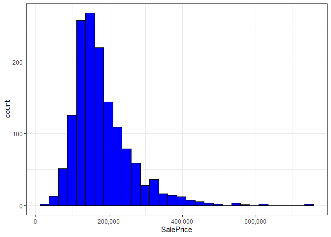

As you can see the distribution is right skewed. For predictive modelling it is usually helpful when the target variable is normally distributed. This can be achieved by various transformation methods, e.g. a logarithmic transformation.

``` r
# look at distribution with log transformation
train %>%
  mutate(log_price = log(SalePrice)) %>%
  ggplot(aes(x = log_price)) +
  theme_bw()  +
  geom_histogram(color = "black", fill = "blue") +
  scale_x_continuous(labels = comma)
```

    ## `stat_bin()` using `bins = 30`. Pick better value with `binwidth`.

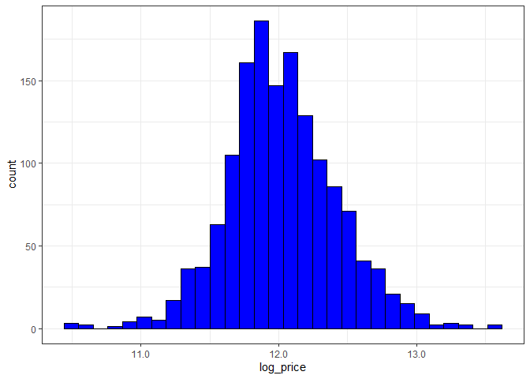

This approximates a normal distribution closer. Thus, the transformed variable can be added to the dataframe.

``` r
# add transformed target variable to the data
all_data <- all_data %>%
  mutate(log_price = log(SalePrice))
```

1.4 "MSSubClass" data type
--------------------------

The feature "MSSubClass" is stored as a numeric datatype, since it has values like 10, 20, 30... However, these numbers are just labels for a closer description of the feature's values. So the data type of this feature should be changed to factor.

``` r
# change data type of "MSSubClass"
all_data$MSSubClass <- factor(all_data$MSSubClass)
```

1.3 Documentation dataframe
---------------------------

To keep track of which features have already been explored or manipulated, I am going to create an additional dataframe. Every feature which has been worked on will be dropped from this dataframe.

``` r
# df with all feature remaining that need to be worked on
remaining <- all_data %>%
  select(-c("Id", "SalePrice", "log_price"))
```

2. Feature exploration, selection and engineering (Focus on numerical features)
===============================================================================

``` r
# number of features
feature_count <- all_data %>%
  select(-c("Id", "SalePrice", "log_price")) %>%
  ncol()

paste0("There are ", feature_count, " features in this dataframe.")
```

    ## [1] "There are 79 features in this dataframe."

I am going to start with exploratory data analysis on the features and their relation to the target variable. First the main concentration is going to be on numeric features since these usually are the main predictors in regression tasks.

``` r
# dataframe with numeric features
num_features <- all_data %>%
  select_if(is.numeric) %>%
  select(-c("Id", "SalePrice", "log_price"))

# list with numeric features
num_features_list <- all_data %>%
  select_if(is.numeric) %>%
  select(-c("Id", "SalePrice", "log_price")) %>%
  colnames()
```

``` r
head(num_features, 3)
```

    ## # A tibble: 3 x 35
    ##   LotFrontage LotArea OverallQual OverallCond YearBuilt YearRemodAdd MasVnrArea
    ##         <dbl>   <dbl>       <dbl>       <dbl>     <dbl>        <dbl>      <dbl>
    ## 1          65    8450           7           5      2003         2003        196
    ## 2          80    9600           6           8      1976         1976          0
    ## 3          68   11250           7           5      2001         2002        162
    ## # ... with 28 more variables: BsmtFinSF_one <dbl>, BsmtFinSF_two <dbl>,
    ## #   BsmtUnfSF <dbl>, TotalBsmtSF <dbl>, firstFlrSF <dbl>, secondFlrSF <dbl>,
    ## #   LowQualFinSF <dbl>, GrLivArea <dbl>, BsmtFullBath <dbl>,
    ## #   BsmtHalfBath <dbl>, FullBath <dbl>, HalfBath <dbl>, BedroomAbvGr <dbl>,
    ## #   KitchenAbvGr <dbl>, TotRmsAbvGrd <dbl>, Fireplaces <dbl>,
    ## #   GarageYrBlt <dbl>, GarageCars <dbl>, GarageArea <dbl>, WoodDeckSF <dbl>,
    ## #   OpenPorchSF <dbl>, EnclosedPorch <dbl>, three_SsnPorch <dbl>,
    ## #   ScreenPorch <dbl>, PoolArea <dbl>, MiscVal <dbl>, MoSold <dbl>,
    ## #   YrSold <dbl>

Since there are so many variables in this dataframe, the first approach is going to be to identify the most important (i.e. most highly correlated) numeric features. Very often there are other similar or closely related features in the dataframe. They can then simultaneously be approached.

``` r
### correlogram

# numeric features including price
num_vars <- all_data %>%
  select_if(is.numeric) %>%
  select(-c("Id", "SalePrice"))

# initial correlation matrix
cor_numvars <- cor(num_vars, use="pairwise.complete.obs")

# sort features based on correlation with "log_price"
cor_sorted <- as.matrix(sort(cor_numvars[,'log_price'], decreasing = TRUE))

# highly correlated features
CorHigh <- names(which(apply(cor_sorted, 1, function(x) abs(x)>0.5)))

# reduce correlation matrix to most important features
cor_numvars <- cor_numvars[CorHigh, CorHigh]

# corrplot
corrplot.mixed(cor_numvars, tl.col="black", tl.pos = "lt")
```

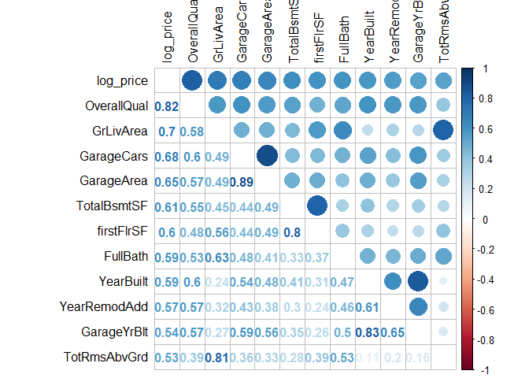

2.1 OverallQual
---------------

### 2.1.1 OverallQual itself

"Rates the overall material and finish of the house".

``` r
# set of values for "OverallQual"
unique(all_data$OverallQual)
```

    ##  [1]  7  6  8  5  9  4 10  3  1  2

``` r
# EDA on "OverallQual"
all_data %>%
  ggplot(aes(x=OverallQual, y=log_price)) +
  geom_point(na.rm=T, position="jitter") +
  scale_x_continuous(breaks=c(1:10)) +
  geom_smooth(method="lm", na.rm=T, col="#009E73", se=F)
```

    ## `geom_smooth()` using formula 'y ~ x'

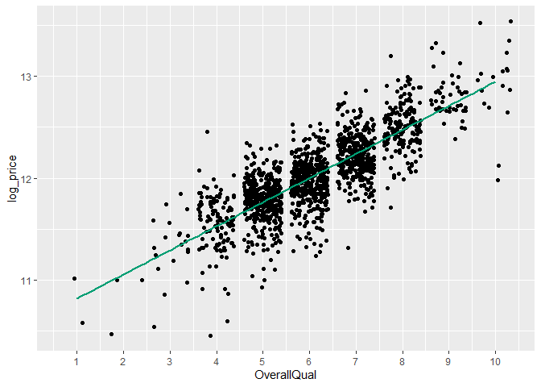

The high correlation clearly becomes visible.

``` r
# check for NAs
sum(is.na(all_data$OverallQual))
```

    ## [1] 0

### 2.1.2 OverallCond

``` r
# EDA on "OverallQual"
all_data %>%
  ggplot(aes(x=OverallCond, y=log_price)) +
  geom_point(na.rm=T, position="jitter") +
  scale_x_continuous(breaks=c(1:10)) +
  geom_smooth(method="lm", na.rm=T, col="#009E73", se=F) +
  geom_smooth(method="lm", na.rm=T, col="#E69F00", se=F, formula=y~x+I(x^2))
```

    ## `geom_smooth()` using formula 'y ~ x'

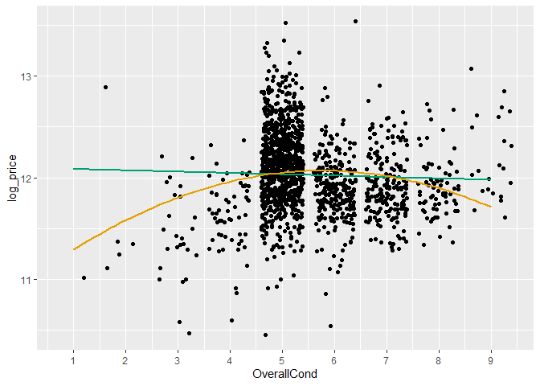

``` r
# calculate correlation between "OverallCond" and "log_price"
cor(all_data$OverallCond, all_data$log_price, use="pairwise.complete.obs")
```

    ## [1] -0.03686799

This feature does not look very helpful at first. However, by applying different regression models/techniques on this feature, it might still give us some useful information.

``` r
### different regression models with "OverallCond"

# simple linear regression
cond_fm_1 <- formula(log_price ~ OverallCond)
cond_fit_1 <- lm(formula = cond_fm_1, data = all_data %>% filter(!is.na(log_price)))

# linear regression with modified formula
cond_fm_2 <- formula(log_price ~ OverallCond + I(OverallCond^2))
cond_fit_2 <- lm(formula = cond_fm_2, data = all_data %>% filter(!is.na(log_price)))

# regression with factor variables.
cond_fm_3 <- formula(log_price ~ as.factor(OverallCond))
cond_fit_3 <- lm(formula = cond_fm_3, data = all_data %>% filter(!is.na(log_price)))


screenreg(list(cond_fit_1, cond_fit_2, cond_fit_3))
```

    ## 
    ## ==============================================================
    ##                          Model 1      Model 2      Model 3    
    ## --------------------------------------------------------------
    ## (Intercept)                12.10 ***    10.93 ***    11.02 ***
    ##                            (0.05)       (0.18)       (0.37)   
    ## OverallCond                -0.01         0.39 ***             
    ##                            (0.01)       (0.06)                
    ## OverallCond^2                           -0.03 ***             
    ##                                         (0.01)                
    ## as.factor(OverallCond)2                               0.57    
    ##                                                      (0.40)   
    ## as.factor(OverallCond)3                               0.42    
    ##                                                      (0.37)   
    ## as.factor(OverallCond)4                               0.63    
    ##                                                      (0.37)   
    ## as.factor(OverallCond)5                               1.13 ** 
    ##                                                      (0.37)   
    ## as.factor(OverallCond)6                               0.87 *  
    ##                                                      (0.37)   
    ## as.factor(OverallCond)7                               0.90 *  
    ##                                                      (0.37)   
    ## as.factor(OverallCond)8                               0.89 *  
    ##                                                      (0.37)   
    ## as.factor(OverallCond)9                               1.18 ** 
    ##                                                      (0.37)   
    ## --------------------------------------------------------------
    ## R^2                         0.00         0.03         0.17    
    ## Adj. R^2                    0.00         0.03         0.16    
    ## Num. obs.                1460         1460         1460       
    ## ==============================================================
    ## *** p < 0.001; ** p < 0.01; * p < 0.05

As you can see using "OverallCond" as a factor variable produces much more promising results than if we look at it as a numeric variable.

``` r
# check for missing values
sum(is.na(all_data$OverallCond))
```

    ## [1] 0

``` r
# change data type of "OverallCond"
all_data$OverallCond <- factor(all_data$OverallCond)
```

``` r
# documentation
remaining <- remaining %>%
  select(-c("OverallQual", "OverallCond"))
```

2.2 Area related features
-------------------------

### 2.2.1 Total square feet (feature engineering)

There are two or rather three main variables which are summed up the total living area in square feet, which are:

-   GrLivArea: "Above grade (ground) living area square feet"
-   TotalBsmtSF: "Total square feet of basement area"
-   LowQualFinSF: "Low quality finished square feet (all floors)"

First of all it should be mentioned that the feature "GrLivArea" is a linear combination of the features "firstFlrSF" and "secondFlrSF" (as well as "LowQualFinSF"). From a customer point of view it seems more reasonable to consider the whole living area in square feet than to distinguish e.g. between the floor levels and then consider the area.

``` r
# check correlations to "log_price" for different kinds of features
cor(all_data$GrLivArea, all_data$log_price, use="pairwise.complete.obs")
```

    ## [1] 0.7009267

``` r
cor(all_data$TotalBsmtSF, all_data$log_price, use="pairwise.complete.obs")
```

    ## [1] 0.612134

``` r
cor(all_data$GrLivArea + all_data$TotalBsmtSF + all_data$LowQualFinSF,
    all_data$log_price, use="pairwise.complete.obs")
```

    ## [1] 0.7666246

``` r
# EDA on "totalSF"
all_data %>%
  mutate(totalSF = GrLivArea + TotalBsmtSF) %>%
  ggplot(aes(x=totalSF, y=log_price)) +
  geom_point(na.rm=T) +
  geom_smooth(method="lm",  na.rm=T,  col="#009E73", se=F)
```

    ## `geom_smooth()` using formula 'y ~ x'

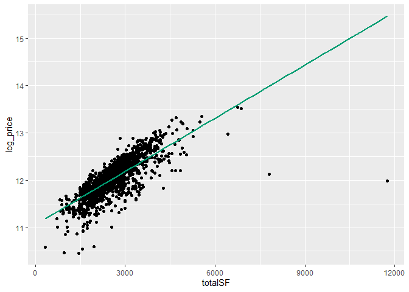

So the total living area in square feet seems to be a very powerful feature which should be created for this dataset.

``` r
# check NAs for needed features before feature engineering
all_data %>%
  select(GrLivArea, TotalBsmtSF, LowQualFinSF) %>%
  summarise_all(funs(sum(is.na(.))))
```

    ## Warning: `funs()` is deprecated as of dplyr 0.8.0.
    ## Please use a list of either functions or lambdas: 
    ## 
    ##   # Simple named list: 
    ##   list(mean = mean, median = median)
    ## 
    ##   # Auto named with `tibble::lst()`: 
    ##   tibble::lst(mean, median)
    ## 
    ##   # Using lambdas
    ##   list(~ mean(., trim = .2), ~ median(., na.rm = TRUE))
    ## This warning is displayed once every 8 hours.
    ## Call `lifecycle::last_warnings()` to see where this warning was generated.

    ## # A tibble: 1 x 3
    ##   GrLivArea TotalBsmtSF LowQualFinSF
    ##       <int>       <int>        <int>
    ## 1         0           1            0

``` r
all_data %>%
  filter(is.na(TotalBsmtSF)) %>%
  select(Id, contains("Bsmt"))
```

    ## # A tibble: 1 x 12
    ##      Id BsmtQual BsmtCond BsmtExposure BsmtFinType_one BsmtFinSF_one
    ##   <dbl> <chr>    <chr>    <chr>        <chr>                   <dbl>
    ## 1  2121 <NA>     <NA>     <NA>         <NA>                       NA
    ## # ... with 6 more variables: BsmtFinType_two <chr>, BsmtFinSF_two <dbl>,
    ## #   BsmtUnfSF <dbl>, TotalBsmtSF <dbl>, BsmtFullBath <dbl>, BsmtHalfBath <dbl>

``` r
# observation has no basement -> TotalBsmtSF == 0
all_data$TotalBsmtSF[all_data$Id == 2121] <- 0
```

``` r
# feature engineering: "totalSF"
all_data <- all_data %>%
  mutate(totalSF = GrLivArea + TotalBsmtSF) %>%
  # drop redundant features
  select(-c("GrLivArea", "firstFlrSF", "secondFlrSF"))
```

### 2.2.2 LowQualFinSF

Unlike the other features which are directly or indirectly related to "totalSF" I didn't drop the feature "LowQualFinSF". Let's first have a quick look at the documentation and see what this feature means:

-   "Low quality finished square feet (all floors)"

Because I think that it might matter if some of the living area is of low quality and have a negative effect on the price I kept this feature in the data. We can check if that assumption is true by briefly running a simplified regression model on "log\_price" with the variable "LowQualFinSF" included in the formula.

``` r
# check impact with a simplified linear regression
fm_lowqual <- formula(log_price ~ OverallQual + totalSF + LowQualFinSF)
fit_lowqual <- lm(fm_lowqual,  all_data %>% filter(!is.na(log_price)))

screenreg(fit_lowqual, digits=4)
```

    ## 
    ## ===========================
    ##               Model 1      
    ## ---------------------------
    ## (Intercept)     10.5573 ***
    ##                 (0.0230)   
    ## OverallQual      0.1549 ***
    ##                 (0.0049)   
    ## totalSF          0.0002 ***
    ##                 (0.0000)   
    ## LowQualFinSF    -0.0004 ***
    ##                 (0.0001)   
    ## ---------------------------
    ## R^2              0.7651    
    ## Adj. R^2         0.7646    
    ## Num. obs.     1460         
    ## ===========================
    ## *** p < 0.001; ** p < 0.01; * p < 0.05

As expected we can see the negative effect of "LowQualFinSF".

``` r
# documentation
remaining <- remaining %>%
  select(-c("GrLivArea", "TotalBsmtSF", "firstFlrSF", "secondFlrSF", "LowQualFinSF"))
```

### 2.2.3 Porch features

In the data there are features for the porch area which are distinguished by the kind of porch:

-   OpenPorchSF
-   EnclosedPorch
-   three\_SsnPorch
-   ScreenPorch

I think that it might be more useful to simply combine these four features into one. I am going to test if that is the case again by running two simplified regression models.

``` r
# check for NAs first
all_data %>%
  select(OpenPorchSF, EnclosedPorch, three_SsnPorch, ScreenPorch) %>%
  summarise_all(funs(sum(is.na(.))))
```

    ## # A tibble: 1 x 4
    ##   OpenPorchSF EnclosedPorch three_SsnPorch ScreenPorch
    ##         <int>         <int>          <int>       <int>
    ## 1           0             0              0           0

``` r
# feature engineering: "totalPorch"
all_data <- all_data %>%
  mutate(totalPorch = OpenPorchSF + EnclosedPorch + three_SsnPorch + ScreenPorch)
```

``` r
# check which features/models are better
fm_porch1 <- formula(log_price ~ OverallQual + totalSF + OpenPorchSF + EnclosedPorch + three_SsnPorch + ScreenPorch)
fm_porch2 <- formula(log_price ~ OverallQual + totalSF + totalPorch)

fit_porch1 <- lm(fm_porch1, data = all_data %>% filter(!is.na(log_price)))
fit_porch2 <- lm(fm_porch2, data = all_data %>% filter(!is.na(log_price)))

screenreg(list(fit_porch1, fit_porch2), digits=4)
```

    ## 
    ## ============================================
    ##                 Model 1        Model 2      
    ## --------------------------------------------
    ## (Intercept)       10.5781 ***    10.5529 ***
    ##                   (0.0235)       (0.0231)   
    ## OverallQual        0.1538 ***     0.1569 ***
    ##                   (0.0049)       (0.0049)   
    ## totalSF            0.0002 ***     0.0002 ***
    ##                   (0.0000)       (0.0000)   
    ## OpenPorchSF        0.0000                   
    ##                   (0.0001)                  
    ## EnclosedPorch     -0.0004 ***               
    ##                   (0.0001)                  
    ## three_SsnPorch     0.0003                   
    ##                   (0.0002)                  
    ## ScreenPorch        0.0003 **                
    ##                   (0.0001)                  
    ## totalPorch                       -0.0000    
    ##                                  (0.0001)   
    ## --------------------------------------------
    ## R^2                0.7692         0.7626    
    ## Adj. R^2           0.7683         0.7621    
    ## Num. obs.       1460           1460         
    ## ============================================
    ## *** p < 0.001; ** p < 0.01; * p < 0.05

In this scenario and based on the selected measures (p-values, R^2) the more complicated model with the distinction between all kinds of porches performs better. But the difference is quite small and is not based on a loss function but on a function that describes how well the model fits the given data. Also there are still lots of more important variables left out which might be important to fit the model and estimate all other effects correctly. So for reasons of parsimony I am going to go with the summarised variable.

``` r
# drop original columns from df
all_data <- all_data %>%
  select(-c("OpenPorchSF", "EnclosedPorch", "three_SsnPorch", "ScreenPorch"))
```

``` r
# documentation
remaining <- remaining %>%
  select(-c("OpenPorchSF", "EnclosedPorch", "three_SsnPorch", "ScreenPorch"))
```

### 2.2.4 Garage area features

There are two features in this dataset which both describe the area of the garage:

-   GarageCars: Size of garage in car capacity
-   GarageArea: Size of garage in square feet

Let's first check out if there appear to be any missing values for these two features in the dataset.

``` r
# check for NAs at "GarageCars" and "GarageArea"
all_data %>%
  select(GarageCars, GarageArea) %>%
  summarise_all(funs(sum(is.na(.))))
```

    ## # A tibble: 1 x 2
    ##   GarageCars GarageArea
    ##        <int>      <int>
    ## 1          1          1

``` r
# inspect NA / NAs
all_data %>%
  filter(is.na(GarageCars) | is.na(GarageArea)) %>%
  select(Id, GarageType, GarageYrBlt, GarageFinish, GarageCars, GarageArea)
```

    ## # A tibble: 1 x 6
    ##      Id GarageType GarageYrBlt GarageFinish GarageCars GarageArea
    ##   <dbl> <chr>            <dbl> <chr>             <dbl>      <dbl>
    ## 1  2577 Detchd              NA <NA>                 NA         NA

``` r
# replace NAs with group median and mean respectively.
all_data <- all_data %>%
  group_by(GarageType, MSSubClass) %>%
  mutate(GarageCars = ifelse(is.na(GarageCars), median(GarageCars, na.rm=T), GarageCars),
         GarageArea = ifelse(is.na(GarageArea), round(mean(GarageArea, na.rm=T)), GarageArea)) %>%
  as_tibble()
```

Both features measure the same thing but in different units. In the correlation plot we could see that the correlation between "GarageCars" and "log\_price" was a bith higher thant between "GarageArea" and "log\_price". Anyways, only one of the two features should be included in the model later on to avoid collinearity. To decide which feature to use, I am going to run three different regression models and compare their fit.

``` r
### different regression models with garage area features

gar_fm1 <- formula(log_price ~ OverallQual + totalSF + GarageArea)
gar_fm2 <- formula(log_price ~ OverallQual + totalSF + GarageCars)
gar_fm3 <- formula(log_price ~ OverallQual + totalSF + as.factor(GarageCars))

gar_fit1 <- lm(gar_fm1, data = all_data %>% filter(!is.na(log_price)))
gar_fit2 <- lm(gar_fm2, data = all_data %>% filter(!is.na(log_price)))
gar_fit3 <- lm(gar_fm3, data = all_data %>% filter(!is.na(log_price)))

screenreg(list(gar_fit1, gar_fit2, gar_fit3), digits=4)
```

    ## 
    ## ===================================================================
    ##                         Model 1        Model 2        Model 3      
    ## -------------------------------------------------------------------
    ## (Intercept)               10.5773 ***    10.5822 ***    10.5595 ***
    ##                           (0.0221)       (0.0217)       (0.0291)   
    ## OverallQual                0.1386 ***     0.1281 ***     0.1274 ***
    ##                           (0.0050)       (0.0050)       (0.0051)   
    ## totalSF                    0.0002 ***     0.0002 ***     0.0002 ***
    ##                           (0.0000)       (0.0000)       (0.0000)   
    ## GarageArea                 0.0003 ***                              
    ##                           (0.0000)                                 
    ## GarageCars                                0.1195 ***               
    ##                                          (0.0082)                  
    ## as.factor(GarageCars)1                                   0.1425 ***
    ##                                                         (0.0225)   
    ## as.factor(GarageCars)2                                   0.2652 ***
    ##                                                         (0.0224)   
    ## as.factor(GarageCars)3                                   0.3694 ***
    ##                                                         (0.0290)   
    ## as.factor(GarageCars)4                                   0.3576 ***
    ##                                                         (0.0841)   
    ## -------------------------------------------------------------------
    ## R^2                        0.7840         0.7930         0.7938    
    ## Adj. R^2                   0.7835         0.7926         0.7929    
    ## Num. obs.               1460           1460           1460         
    ## ===================================================================
    ## *** p < 0.001; ** p < 0.01; * p < 0.05

Choosing the second model, i.e. using "GarageCars" as a simple predictor seems advisable. It gives a slightly better fit than when using "GarageArea". Using "GarageCars" as a factor variable increases R^2 a slightly, but would increase the number of used features significantly.

``` r
# drop "GarageArea" from df
all_data <- all_data %>%
  select(-c("GarageArea"))

# documentation
remaining <- remaining %>%
  select(-c("GarageArea", "GarageCars"))
```

### 2.2.5 Miscellaneous area (related) features

-   LotFrontage: Linear feet of street connected to property
-   LotArea: Lot size in square feet
-   MasVnrArea: Masonry veneer area in square feet
-   WoodDeckSF: Wood deck area in square feet

I am not going to pay a lot of attention to these features and perform an EDA on them.

``` r
# check for NAs of the features
all_data %>%
  select(LotFrontage, LotArea, MasVnrArea, WoodDeckSF) %>%
  summarise_all(funs(sum(is.na(.))))
```

    ## # A tibble: 1 x 4
    ##   LotFrontage LotArea MasVnrArea WoodDeckSF
    ##         <int>   <int>      <int>      <int>
    ## 1         486       0         23          0

Let's begin with the NAs at "LotFrontage" since this column contains the most NAs.

``` r
# see if there are patterns where LotFrontage values are missing
summary(filter(all_data, !is.na(LotFrontage))$LotArea)
```

    ##    Min. 1st Qu.  Median    Mean 3rd Qu.    Max. 
    ##    1300    7250    9260    9726   11216  215245

``` r
summary(filter(all_data, is.na(LotFrontage))$LotArea)
```

    ##    Min. 1st Qu.  Median    Mean 3rd Qu.    Max. 
    ##    1533    8125   10452   12380   12928  164660

There is no clear pattern.

I am going to impute the missing values at "LotFrontage" with a regression function that fits the data fairly well:

``` r
# regression model for imputing "LotFrontage" NAs
lotfront_fm <- formula(LotFrontage ~ I(sqrt(LotArea)) + LotConfig + Neighborhood + BldgType)
lotfront_fit <- lm(lotfront_fm, all_data)

paste0("Adjusted R squared of model for imputation is: ", round(summary(lotfront_fit)$adj.r.squared, 2))
```

    ## [1] "Adjusted R squared of model for imputation is: 0.6"

``` r
# impute NAs at "LotFrontage"
all_data <- all_data %>%
  mutate(LotFrontage = ifelse(is.na(LotFrontage), round(predict(lotfront_fit, .)), LotFrontage))
```

MasVnrArea:

``` r
all_data %>%
  filter(is.na(MasVnrArea)) %>%
  select(Id, MasVnrType, MasVnrArea)
```

    ## # A tibble: 23 x 3
    ##       Id MasVnrType MasVnrArea
    ##    <dbl> <chr>           <dbl>
    ##  1   235 <NA>               NA
    ##  2   530 <NA>               NA
    ##  3   651 <NA>               NA
    ##  4   937 <NA>               NA
    ##  5   974 <NA>               NA
    ##  6   978 <NA>               NA
    ##  7  1244 <NA>               NA
    ##  8  1279 <NA>               NA
    ##  9  1692 <NA>               NA
    ## 10  1707 <NA>               NA
    ## # ... with 13 more rows

I assume that these observations simply don't have a masonry veneer. Hence, these can be filled with 0s.

``` r
# replace NAs at "MasVnrArea"
all_data$MasVnrArea <- replace_na(all_data$MasVnrArea, 0)
```

``` r
# documentation
remaining <- remaining %>%
  select(-c("LotFrontage", "LotArea", "MasVnrArea", "WoodDeckSF"))
```

### 2.2.6 Basement Area features

Even though the basement area is already included in the feature "totalSF" I kept these features because they distinguish between different quality types of the basement area:

-   GLQ: Good Living Quarters
-   ALQ: Average Living Quarters
-   BLQ: Below Average Living Quarters
-   Rec: Average Rec Room
-   LwQ: Low Quality
-   Unf: Unfinshed

I am going to come back to the importance of this distinction later on. For now I am just going to check if the columns contain missing values.

``` r
all_data %>%
  select(BsmtFinSF_one, BsmtFinSF_two, BsmtUnfSF) %>%
  summarise_all(funs(sum(is.na(.))))
```

    ## # A tibble: 1 x 3
    ##   BsmtFinSF_one BsmtFinSF_two BsmtUnfSF
    ##           <int>         <int>     <int>
    ## 1             1             1         1

``` r
# observations with NAs in one of the columns
all_data %>%
  filter(is.na(BsmtFinSF_one) | is.na(BsmtFinSF_two) | is.na(BsmtUnfSF)) %>%
  select(Id, contains("Bsmt"))
```

    ## # A tibble: 1 x 12
    ##      Id BsmtQual BsmtCond BsmtExposure BsmtFinType_one BsmtFinSF_one
    ##   <dbl> <chr>    <chr>    <chr>        <chr>                   <dbl>
    ## 1  2121 <NA>     <NA>     <NA>         <NA>                       NA
    ## # ... with 6 more variables: BsmtFinType_two <chr>, BsmtFinSF_two <dbl>,
    ## #   BsmtUnfSF <dbl>, TotalBsmtSF <dbl>, BsmtFullBath <dbl>, BsmtHalfBath <dbl>

``` r
# replace NAs
all_data$BsmtFinSF_one <- replace_na(all_data$BsmtFinSF_one, 0)
all_data$BsmtFinSF_two <- replace_na(all_data$BsmtFinSF_two, 0)
all_data$BsmtUnfSF <- replace_na(all_data$BsmtUnfSF, 0)
```

``` r
# documentation
remaining <- remaining %>%
  select(-c("BsmtFinSF_one", "BsmtFinSF_two", "BsmtUnfSF"))
```

### 2.2.7 Transforming area related variables

At the very beginning we have already transformed the dependent variable by taking the logarith of "SalePrice". Independent variables, in this case especially those which are square feet or feet measures, can also tend to have a heavily tailed distribution, which is not advantegous for linear regression models. Because of that I am going to check if the variables are skewed and then transform then with Tukeys power transformation. These are the concerned features:

-   totalSF
-   LowQualFinSF
-   totalPorch
-   LotFrontage
-   LotArea
-   MasVnrArea
-   WoodDeckSF
-   Basement features (TotalBsmtSF)

Care must be taken with the features, that have lots of 0 values (e.g. LowQualFinSF, BsmtSF\_two, ...). I am not going to transform them straight away, but first calculate relative shares.

``` r
# calculate shares of more specific area related features
all_data <- all_data %>%
  mutate(BsmtFinSF_one_share = BsmtFinSF_one / TotalBsmtSF,
         BsmtFinSF_two_share = BsmtFinSF_two / TotalBsmtSF,
         BsmtUnfSF_share = BsmtUnfSF / TotalBsmtSF,
         LowQualFinSF_share = LowQualFinSF / totalSF) %>%
  # replace NAs which result from 0 in denominator
  mutate_at(vars(BsmtFinSF_one_share, BsmtFinSF_two_share, BsmtUnfSF_share, LowQualFinSF_share),
            ~replace_na(., 0))
```

For the other features (totalSF, TotalBsmtSF, totalPorch, LotFrontage, LotArea, MasVnrArea, WoodDeckSF) the skewness measure can first be calculated to demonstrate that this is an issue. If the measure equals 0 the data is perfectly symmetric. Absolute values greater than 1 indicate that the data is skewed and might be worth considering transforming.

``` r
# list of area related features
areas <- c("totalSF", "TotalBsmtSF", "totalPorch", "LotFrontage", "LotArea", "MasVnrArea", "WoodDeckSF")

for(var in areas){
  v <- all_data %>% select(var)
  skew <- skewness(v, na.rm=T)
  
  print(paste0(var, " (skewness): ", skew))
}
```

    ## Note: Using an external vector in selections is ambiguous.
    ## i Use `all_of(var)` instead of `var` to silence this message.
    ## i See <https://tidyselect.r-lib.org/reference/faq-external-vector.html>.
    ## This message is displayed once per session.

    ## [1] "totalSF (skewness): 1.5111570323866"
    ## [1] "TotalBsmtSF (skewness): 1.15689413666998"
    ## [1] "totalPorch (skewness): 2.23726624318346"
    ## [1] "LotFrontage (skewness): 1.4201462889849"
    ## [1] "LotArea (skewness): 12.8224314015567"
    ## [1] "MasVnrArea (skewness): 2.6135921295018"
    ## [1] "WoodDeckSF (skewness): 1.84243281111848"

All analyzed features are skewed. Very notable is the high skewness of the feature "LotArea". Other high skewness measures (e.g. "totalPorch" or "MasVnrArea") are probably due to lots of 0s in the data. To get rid of the skewnesses in parts I am now going to perform Tukey's ladder of powers transformation on the variables.

``` r
# copy of previous data to compare correlations before and after transformation
check_df <- all_data %>%
  select(totalSF, TotalBsmtSF, totalPorch, LotFrontage, LotArea, MasVnrArea, WoodDeckSF, log_price)
```

``` r
### unskew area related features
all_data <- all_data %>%
  mutate_at(vars(totalSF, TotalBsmtSF, totalPorch, LotFrontage, LotArea, MasVnrArea, WoodDeckSF),
            ~transformTukey(., quiet=T, plotit=F))

# calculate the absolute share (BsmtFinSF_one, LowQualFinSF, ...) again
all_data <- all_data %>%
  mutate(BsmtFinSF_one = TotalBsmtSF * BsmtFinSF_one_share,
         BsmtFinSF_two = TotalBsmtSF * BsmtFinSF_two_share,
         BsmtUnfSF = TotalBsmtSF * BsmtUnfSF_share,
         LowQualFinSF = totalSF * LowQualFinSF_share) %>%
  # drop columns which are no longer needed
  select(-c("BsmtFinSF_one_share", "BsmtFinSF_two_share", "BsmtUnfSF_share", "LowQualFinSF_share", "TotalBsmtSF"))
```

``` r
### compare correlations before and after transformation

# columns (names) to compare the correlations
var_names <- c("totalSF", "totalPorch", "LotFrontage", "LotArea", "MasVnrArea", "WoodDeckSF")

for(var in var_names){
  
  vec_1 <- check_df %>% select(var)
  vec_2 <- all_data %>% select(var)
  price <- all_data$log_price
  
  cor_1 <- cor(vec_1, price, use="pairwise.complete.obs")
  cor_2 <- cor(vec_2, price, use="pairwise.complete.obs")
  
  cor_increase <- round(cor_2 - cor_1, 3)
  
  print(paste0("Increase in correlation to log_price ", "(", var, "): ", cor_increase))
}
```

    ## [1] "Increase in correlation to log_price (totalSF): 0.033"
    ## [1] "Increase in correlation to log_price (totalPorch): 0.069"
    ## [1] "Increase in correlation to log_price (LotFrontage): 0.01"
    ## [1] "Increase in correlation to log_price (LotArea): 0.143"
    ## [1] "Increase in correlation to log_price (MasVnrArea): 0.012"
    ## [1] "Increase in correlation to log_price (WoodDeckSF): 0.018"

The transformation seems to have been very effective. Especially the increase of the correlation to "log\_price" for the variable "LotArea" is notable.

### 2.2.8 Qualitative information on area features

For some of the area features the data contains additional information about the quality of that area. That information is either directly contained in the feature (e.g. "LowQualFinSF" or "BsmtUnfSF") or it is indirectly available ("BsmtFinSF\_one", "BsmtFinSF\_one"). The latter is of interest here.

The basement area is distinguished between "BsmtFinSF\_one", "BsmtFinSF\_two" and "BsmtUnfSF". The first two features refer to the rating types ("BsmtFinType\_one", "BsmtFinType\_two") of the basement area with the possible values:

-   GLQ: Good Living Quarters
-   ALQ: Average Living Quarters
-   BLQ: Below Average Living Quarters
-   Rec: Average Rec Room
-   LwQ: Low Quality
-   Unf: Unfinshed
-   NA: No Basement

So the first thing we need to do is check out NA occurences at "BsmtFinType\_one" / "BsmtFinType\_two".

``` r
# count NAs
all_data %>%
  select(BsmtFinType_one, BsmtFinType_two) %>%
  summarise_all(funs(sum(is.na(.))))
```

    ## # A tibble: 1 x 2
    ##   BsmtFinType_one BsmtFinType_two
    ##             <int>           <int>
    ## 1              79              80

``` r
# replace NAs at "BsmtFinType_one"
all_data$BsmtFinType_one <- replace_na(all_data$BsmtFinType_one, "None")
```

Above you could see that there is one more NA at "BsmtFinType\_two" thant at "BsmtFinType\_one", which does not fit the picture.

``` r
# inspect redundant NA at "BsmtFinType_two"
all_data %>%
  filter(BsmtFinType_one != "None", is.na(BsmtFinType_two)) %>%
  select(Id, contains("Bsmt"))
```

    ## # A tibble: 1 x 11
    ##      Id BsmtQual BsmtCond BsmtExposure BsmtFinType_one BsmtFinSF_one
    ##   <dbl> <chr>    <chr>    <chr>        <chr>                   <dbl>
    ## 1   333 Gd       TA       No           GLQ                      274.
    ## # ... with 5 more variables: BsmtFinType_two <chr>, BsmtFinSF_two <dbl>,
    ## #   BsmtUnfSF <dbl>, BsmtFullBath <dbl>, BsmtHalfBath <dbl>

So there seems to be one "real" NA which needs to be imputed. I want to impute the NA with the (group's) mode, but in most of the cases that is "Unf" which cannot be the case here, since "BsmtFinSF\_two" would then equal 0. So I am first going to calculate the mode excluding observations where "BsmtFinType\_two" equals "Unf":

``` r
all_data %>%
  filter(BsmtFinType_two != "Unf") %>%
  group_by(BsmtFinType_one) %>%
  summarise(getmode(BsmtFinType_two))
```

    ## `summarise()` ungrouping output (override with `.groups` argument)

    ## # A tibble: 5 x 2
    ##   BsmtFinType_one `getmode(BsmtFinType_two)`
    ##   <chr>           <chr>                     
    ## 1 ALQ             Rec                       
    ## 2 BLQ             Rec                       
    ## 3 GLQ             Rec                       
    ## 4 LwQ             Rec                       
    ## 5 Rec             LwQ

For any primer basement area type the mode of "BsmtFinType\_two" is "Rec", except if "Rec" is the primer type itself. So we can impute the NA with "Rec".

``` r
# replace "real" NA at "BsmtFinType_two"
all_data$BsmtFinType_two[all_data$Id == 333] <- "Rec"
```

Now the rest of the NAs can be filled with "None" as well.

``` r
all_data$BsmtFinType_two <- replace_na(all_data$BsmtFinType_two, "None")
```

I also noticed that whenever "BsmtFinType\_two" == "Unf", then "BsmtFinSF\_two" == 0, except for one case:

``` r
all_data %>%
  filter(BsmtFinType_two == "Unf", BsmtFinSF_two > 0) %>%
  select(Id, contains("Bsmt"))
```

    ## # A tibble: 1 x 11
    ##      Id BsmtQual BsmtCond BsmtExposure BsmtFinType_one BsmtFinSF_one
    ##   <dbl> <chr>    <chr>    <chr>        <chr>                   <dbl>
    ## 1  2285 Gd       TA       No           GLQ                      187.
    ## # ... with 5 more variables: BsmtFinType_two <chr>, BsmtFinSF_two <dbl>,
    ## #   BsmtUnfSF <dbl>, BsmtFullBath <dbl>, BsmtHalfBath <dbl>

This observation might have a different value at "BsmtFinType\_two" than reported, but since "BsmtFinSF\_two" is so small, I am simply going to add this up to "BsmtUnfSF".

``` r
# change basement area data at mentioned observation
all_data$BsmtUnfSF[all_data$Id == 2285] <- all_data$BsmtUnfSF[all_data$Id == 2285] + all_data$BsmtFinSF_two[all_data$Id == 2285]
all_data$BsmtFinSF_two[all_data$Id == 2285] <- 0
```

Now that there are no more NAs or suspect values, we can go on with the actual purpose of this step and extract the information about the quality of the basement area. I am going to create interactions between the area and the types of the basements.

``` r
# combine "BsmtFinSF_one" and "BsmtFinType_one" to new features
bsmt_one <- as_tibble(model.matrix( ~BsmtFinSF_one:BsmtFinType_one - 1, data=select(all_data,  BsmtFinSF_one, BsmtFinType_one))) %>%
  rename_all( ~str_replace_all(., "_one:BsmtFinType_one", "_")) %>%
  select(-contains("None"), -contains("Unf"))

# combine "BsmtFinSF_two" and "BsmtFinType_two" to new features
bsmt_two <- as_tibble(model.matrix( ~BsmtFinSF_two:BsmtFinType_two - 1, data=select(all_data,  BsmtFinSF_two, BsmtFinType_two))) %>%
  rename_all( ~str_replace_all(., "_two:BsmtFinType_two", "_")) %>%
  select(-contains("None"), -contains("Unf"))

# sum up dataframes
bsmt_compl <- bsmt_one + bsmt_two

# add new features to original df
all_data <- all_data %>%
  cbind(bsmt_compl) %>%
  relocate(BsmtUnfSF, .after = last_col()) %>%
  select(-c("BsmtFinType_one", "BsmtFinSF_one", "BsmtFinType_two", "BsmtFinSF_two"))
```

``` r
# documentation
remaining <- remaining %>%
  select(-c("BsmtFinType_one", "BsmtFinType_two"))
```

2.3 Rooms count features
------------------------

### 2.3.1 Bathrooms

``` r
# features related to the number of bathrooms
all_data %>%
  select(contains("Bath")) %>%
  colnames()
```

    ## [1] "BsmtFullBath" "BsmtHalfBath" "FullBath"     "HalfBath"

``` r
# check for NAs
all_data %>%
  select(contains("Bath")) %>%
  summarise_all(funs(sum(is.na(.))))
```

    ##   BsmtFullBath BsmtHalfBath FullBath HalfBath
    ## 1            2            2        0        0

``` r
all_data %>%
  filter(is.na(BsmtFullBath) | is.na(BsmtHalfBath)) %>%
  select(Id, contains("Bsmt"), contains("Bath"))
```

    ##     Id BsmtQual BsmtCond BsmtExposure BsmtFullBath BsmtHalfBath BsmtFinSF_ALQ
    ## 1 2121     <NA>     <NA>         <NA>           NA           NA             0
    ## 2 2189     <NA>     <NA>         <NA>           NA           NA             0
    ##   BsmtFinSF_BLQ BsmtFinSF_GLQ BsmtFinSF_LwQ BsmtFinSF_Rec BsmtUnfSF FullBath
    ## 1             0             0             0             0         0        1
    ## 2             0             0             0             0         0        3
    ##   HalfBath
    ## 1        0
    ## 2        1

It simply seems like these two observations don't have a basement and hence no further bathrooms.

``` r
# replace NAs (basement bathrooms)
all_data <- all_data %>%
  mutate_at(vars(BsmtHalfBath, BsmtFullBath), ~replace_na(., 0))
```

I think that the location of the bathrooms is not really of high relevance. Hence, I am going to sum up the bathrooms and put them into one feature. Half bathrooms are given half weight.

``` r
# bathsTotal (feature engineering)
all_data <- all_data %>%
  mutate(bathsTotal = BsmtFullBath + FullBath + 0.5 * (BsmtHalfBath + HalfBath)) %>%
  select(-c("BsmtHalfBath", "BsmtFullBath", "HalfBath", "FullBath"))
```

``` r
# documentation
remaining <- remaining %>%
  select(-c("BsmtHalfBath", "BsmtFullBath", "HalfBath", "FullBath"))
```

### 2.3.2 Further room features

``` r
# check for NAs
all_data %>%
  select(BedroomAbvGr, KitchenAbvGr, TotRmsAbvGrd) %>%
  summarise_all(funs(sum(is.na(.))))
```

    ##   BedroomAbvGr KitchenAbvGr TotRmsAbvGrd
    ## 1            0            0            0

``` r
# calculate correlation of features to "log_price"
all_data %>%
  summarise_at(vars(BedroomAbvGr, KitchenAbvGr, TotRmsAbvGrd), ~cor(., log_price, use="pairwise.complete.obs"))
```

    ##   BedroomAbvGr KitchenAbvGr TotRmsAbvGrd
    ## 1    0.2090437   -0.1475481    0.5344222

The feature "KitchenAbvGr" can definitely be dropped. The correlation is rather small and even negative, which also makes sense from a practical point of view: There rarely is a reason why a house would have more than one kitchen, i.e. there is no reason to think of, why this feature would have predictive power. "BedroomAbvGr" probably is collinear with "TotRmsAbvGr" and hess less correlation with "log\_price", so this feature is going to be dropped, too.

``` r
# drop mentioned room features
all_data <- all_data %>%
  select(-c("BedroomAbvGr", "KitchenAbvGr"))
```

``` r
# documentation
remaining <- remaining %>%
  select(-c("BedroomAbvGr", "KitchenAbvGr", "TotRmsAbvGrd"))
```

2.4 Age and year of building
----------------------------

### 2.4.1 Age of houses / YearBuilt

``` r
# check for NAs
sum(is.na(all_data$YearBuilt))
```

    ## [1] 0

At the beginning of section 2 we could already see that "YearBuilt" has a fairly high correlation with "log\_price". However, the interpretation of that is not that intuitive and it would be more handy to simply calculate the age of the houses.

``` r
# age_house (feature engineering)
all_data <- all_data %>%
  mutate(age_house = 2020 - YearBuilt)
```

``` r
cor(all_data$age_house, all_data$log_price, use="pairwise.complete.obs")
```

    ## [1] -0.5865702

The correlation is the same as if we simply used "YearBuilt". Still I think the interpretation now is more intuitive: The older the house is, the less it tends to be worth.

``` r
# visual EDA on "age_house"
all_data %>%
  ggplot(aes(x=age_house, y=log_price)) +
  geom_point(na.rm=T) +
  geom_smooth(method="lm", na.rm=T, col="#E69F00") +
  geom_smooth(method="lm", na.rm=T, col="#0072B2", formula=y~x+I(x^2))
```

    ## `geom_smooth()` using formula 'y ~ x'

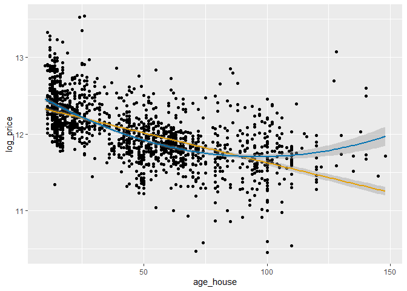

Based on the plot above you can tell that it might be worth including a quadratic term for "age\_house", which can capture a non-linear effect of the feature. Sometimes very old houses tend to be worth more, e.g. because they have a historical value or are very well located. I am briefly going to check this relationship again based on two regression models (one with and one without quadratic term).

``` r
### regression models to check impact of including quadratic term for "age_house"
age_fm1 <- formula(log_price  ~ totalSF + OverallQual + Neighborhood + age_house)
age_fm2 <- formula(log_price  ~ totalSF + OverallQual + Neighborhood + age_house + I(age_house^2))

age_fit1 <- lm(age_fm1, filter(all_data, !is.na(log_price)))
age_fit2 <- lm(age_fm2, filter(all_data, !is.na(log_price)))

print(paste0("Adj. R^2 of base model: ", round(summary(age_fit1)$adj.r.squared, 3)))
```

    ## [1] "Adj. R^2 of base model: 0.841"

``` r
print(paste0("Adj. R^2 of modified model: ", round(summary(age_fit2)$adj.r.squared, 3)))
```

    ## [1] "Adj. R^2 of modified model: 0.841"

Including a quadratic term of "house\_age" in a multivariate setting does not lead to a better performance of the statistical model. That is probably due to the fact that the reason for very old houses being more expensive again is there good location in the city. And that information again is contained in variables like "Neighborhood". Hence, a quadratic term is not going to be included in the models.

### 2.4.1 Remodelling

-   YearRemodAdd: Remodel date (same as construction date if no remodeling or additions)

I am going to use this feature to create a dummy variable indicating if the house has ever gotten a remodelling.

``` r
# check for NAs and weird values
summary(all_data$YearRemodAdd)
```

    ##    Min. 1st Qu.  Median    Mean 3rd Qu.    Max. 
    ##    1950    1965    1993    1984    2004    2010

``` r
# "has_remod" (feature engineering)
all_data <- all_data %>%
  mutate(has_remod = ifelse(YearRemodAdd == YearBuilt, 0, 1))
```

### 2.4.2 GarageYrBlt

Similarly as proceeded with the feature "YearBuilt" we could create the feature "age\_garage" based on the original feature "GarageYrBlt". However, I don't think that's advantegous since in most cases this would result in the same feature like before.

``` r
# how often is "YearBuilt" and "GarageYrBlt" the same?
all_data %>%
  filter(!is.na(GarageYrBlt)) %>%
  mutate(same_year = ifelse(YearBuilt == GarageYrBlt, T, F)) %>%
  count(same_year)
```

    ##   same_year    n
    ## 1     FALSE  544
    ## 2      TRUE 2216

Furthermore this feature cannot be calculated for every observations, because not every house has a garage:

``` r
sum(is.na(all_data$GarageYrBlt))
```

    ## [1] 159

What I am going to use this for however, is to create the feature "has\_garage" to show if the house has a garage or not.

``` r
# "has_garage" (feature engineering)
all_data <- all_data %>%
  mutate(has_garage = ifelse(is.na(GarageYrBlt), 0, 1)) %>%
  select(-c("GarageYrBlt", "YearBuilt", "YearRemodAdd"))
```

``` r
# documentation
remaining <- remaining %>%
  select(-c("YearBuilt", "YearRemodAdd", "GarageYrBlt"))
```

2.5 Remaining numeric features
------------------------------

``` r
# overview of remaining numeric features
remaining %>%
  select_if(is.numeric) %>%
  colnames()
```

    ## [1] "Fireplaces" "PoolArea"   "MiscVal"    "MoSold"     "YrSold"

### 2.5.1 Year and month sold

``` r
# check for NAs
all_data %>%
  select(MoSold, YrSold) %>%
  summarise_all(funs(sum(is.na(.))))
```

    ##   MoSold YrSold
    ## 1      0      0

``` r
table(all_data$YrSold)
```

    ## 
    ## 2006 2007 2008 2009 2010 
    ##  619  692  622  647  339

The features "MoSold" and "YrSold" are currently stored as numeric variables. However that does not make sense for a regression model, because you cannot say that e.g. December is worse or better than January. The same basically goes for the year sold, since there are only five different years in the data. The solution to this is to turn these variables into factor variables.

``` r
# turn "YrSold" and "MoSold" to factors
all_data <- all_data %>%
  mutate(MoSold = factor(MoSold),
         YrSold = factor(YrSold))
```

If these features have a significant effect on the house prices is questionable. Especially for the year however, I think that it might have an effect because the time span includes the financial crisis. I am not going into the details and perform EDA at this point however, and instead just let the models do the work later on.

### 2.5.2 Miscellaneous features

``` r
# overview of remaining features
remaining %>%
  select_if(is.numeric) %>%
  head(3)
```

    ## # A tibble: 3 x 5
    ##   Fireplaces PoolArea MiscVal MoSold YrSold
    ##        <dbl>    <dbl>   <dbl>  <dbl>  <dbl>
    ## 1          0        0       0      2   2008
    ## 2          1        0       0      5   2007
    ## 3          1        0       0      9   2008

``` r
# check if there are NAs
all_data %>%
  select(Fireplaces, PoolArea, MiscVal) %>%
  summarise_all(funs(sum(is.na(.))))
```

    ##   Fireplaces PoolArea MiscVal
    ## 1          0        0       0

``` r
# distribution Fireplaces
table(all_data$Fireplaces)
```

    ## 
    ##    0    1    2    3    4 
    ## 1420 1268  219   11    1

No further feature engineering or manipulation here.

Next, we can explore the feature "PoolArea". Let's first check out, how many houses even have a pool:

``` r
# how many houses do have a pool?
sum(all_data$PoolArea == 0)
```

    ## [1] 2906

``` r
sum(all_data$PoolArea > 0)
```

    ## [1] 13

Since there are only 13 houses in total that do have a pool, I am going to create the dummy variable "has\_pool" and drop all other features related to the pool.

``` r
# create "has_pool" dummy (feature engineering)
all_data <- all_data %>%
  mutate(has_pool = ifelse(PoolArea == 0, 0, 1)) %>%
  select(-contains("Pool"))
```

MiscVal: $Value of miscellaneous feature

``` r
sum(all_data$MiscVal == 0)
```

    ## [1] 2816

I am not going to pay any further attention to "MiscVal" but am just going to make use of the corresponding feature "MiscFeature" later on.

``` r
# drop "MiscVal"
all_data <- all_data %>%
  select(-c("MiscVal"))
```

``` r
# documentation
remaining <- remaining %>%
  select(-contains("Pool"), -contains("Sold"), -c("Fireplaces", "MiscVal"))
```

3. Feature exploration, selection and engineering (Focus categorical features)
==============================================================================

All numeric features have been worked on, which leaves us with the factor variables. I think that it will rather be rarely the case that a more detailed EDA on these features is very beneficial, so I am goint to try to keep this section rather short. At the beginning I want to start of with checking for NAs and imputing them.

3.1 Handling missing values
---------------------------

``` r
# count NAs for remaining factor/character collumns
all_data %>%
  select(all_of(colnames(remaining))) %>%
  summarise_all(funs(sum(is.na(.)))) %>%
  select_if(~.x > 0)
```

    ##   MSZoning Alley Utilities Exterior_first Exterior_second MasVnrType BsmtQual
    ## 1        4  2721         2              1               1         24       81
    ##   BsmtCond BsmtExposure Electrical KitchenQual Functional FireplaceQu
    ## 1       82           82          1           1          2        1420
    ##   GarageType GarageFinish GarageQual GarageCond Fence MiscFeature SaleType
    ## 1        157          159        159        159  2348        2814        1

Let's start with the columns with the most missing values.

### 3.1.1 Alley

Alley: Type of alley access to property

-   Grvl: Gravel
-   Pave: Paved
-   NA: No alley access

``` r
# distribution of "Alley" values
table(all_data$Alley, useNA="always")
```

    ## 
    ## Grvl Pave <NA> 
    ##  120   78 2721

``` r
# replace NAs with "no_alley"
all_data$Alley <- replace_na(all_data$Alley, "None")
```

### 3.1.2 MiscFeature

MiscFeature: Miscellaneous feature not covered in other categories

``` r
# occurences of "MiscFeature"
table(all_data$MiscFeature)
```

    ## 
    ## Gar2 Othr Shed TenC 
    ##    5    4   95    1

Based on this feature we can create the variable "has\_shed". All other values do not occur often enough to possibly infer useful information from them.

``` r
# create "has_shed" dummy (feature engineering)
all_data <- all_data %>%
  mutate(has_shed = ifelse(MiscFeature == "Shed", 1, 0),
         has_shed = replace_na(has_shed, 0)) %>%
  select(-MiscFeature)
```

### 3.1.3 Fence

Fence: Fence quality

-   GdPrv: Good Privacy
-   MnPrv: Minimum Privacy
-   GdWo: Good Wood
-   MnWw: Minimum Wood/Wire
-   NA: No Fence

``` r
table(all_data$Fence, useNA="always")
```

    ## 
    ## GdPrv  GdWo MnPrv  MnWw  <NA> 
    ##   118   112   329    12  2348

``` r
# replace NAs at "Fence"
all_data$Fence <- replace_na(all_data$Fence, "None")
```

``` r
# documentation
remaining <- remaining %>%
  select(-c("Alley", "MiscFeature", "Fence"))
```

``` r
# count NAs for remaining factor/character collumns
all_data %>%
  select(all_of(colnames(remaining))) %>%
  summarise_all(funs(sum(is.na(.)))) %>%
  select_if(~.x > 0)
```

    ##   MSZoning Utilities Exterior_first Exterior_second MasVnrType BsmtQual
    ## 1        4         2              1               1         24       81
    ##   BsmtCond BsmtExposure Electrical KitchenQual Functional FireplaceQu
    ## 1       82           82          1           1          2        1420
    ##   GarageType GarageFinish GarageQual GarageCond SaleType
    ## 1        157          159        159        159        1

### 3.1.4 Basement features

``` r
all_data %>%
  select(all_of(colnames(remaining))) %>%
  select(contains("Bsmt")) %>%
  summarise_all(funs(sum(is.na(.)))) %>%
  select_if(~.x > 0)
```

    ##   BsmtQual BsmtCond BsmtExposure
    ## 1       81       82           82

In general, when there are missing values at the basement features this is supposed to mean that there is no basement. However, there's discrepancy between the number of NAs for the different features, which leads to the assumption that there are some real NAs for at least some of the features.

``` r
# obtain "real" NAs at "BsmtCond"
all_data %>%
  filter(is.na(BsmtCond), !is.na(BsmtQual)) %>%
  select(Id, contains("Bsmt"))
```

    ##     Id BsmtQual BsmtCond BsmtExposure BsmtFinSF_ALQ BsmtFinSF_BLQ BsmtFinSF_GLQ
    ## 1 2041       Gd     <NA>           Mn        0.0000        0.0000      292.9069
    ## 2 2186       TA     <NA>           No        0.0000      302.0047        0.0000
    ## 3 2525       TA     <NA>           Av      225.5942        0.0000        0.0000
    ##   BsmtFinSF_LwQ BsmtFinSF_Rec BsmtUnfSF
    ## 1             0      107.1747   0.00000
    ## 2             0        0.0000  27.48155
    ## 3             0        0.0000  71.71206

``` r
# get group mode of "BsmtCond"
all_data %>%
  group_by(BsmtQual) %>%
  summarise(getmode(BsmtCond))
```

    ## `summarise()` ungrouping output (override with `.groups` argument)

    ## # A tibble: 5 x 2
    ##   BsmtQual `getmode(BsmtCond)`
    ##   <chr>    <chr>              
    ## 1 Ex       TA                 
    ## 2 Fa       TA                 
    ## 3 Gd       TA                 
    ## 4 TA       TA                 
    ## 5 <NA>     <NA>

``` r
# replace Nas for concerned rows
all_data <- all_data %>%
  mutate(BsmtCond = ifelse(Id %in% c(2041, 2186, 2525), "TA", BsmtCond))
```

``` r
# obtain "real" NAs at "BsmtQual"
all_data %>%
  filter(!is.na(BsmtCond), is.na(BsmtQual)) %>%
  select(Id, contains("Bsmt"))
```

    ##     Id BsmtQual BsmtCond BsmtExposure BsmtFinSF_ALQ BsmtFinSF_BLQ BsmtFinSF_GLQ
    ## 1 2218     <NA>       Fa           No             0             0             0
    ## 2 2219     <NA>       TA           No             0             0             0
    ##   BsmtFinSF_LwQ BsmtFinSF_Rec BsmtUnfSF
    ## 1             0             0  70.20823
    ## 2             0             0 127.33455

``` r
# group mode of "BsmtQual"
all_data %>%
  group_by(BsmtCond) %>%
  summarise(getmode(BsmtQual))
```

    ## `summarise()` ungrouping output (override with `.groups` argument)

    ## # A tibble: 5 x 2
    ##   BsmtCond `getmode(BsmtQual)`
    ##   <chr>    <chr>              
    ## 1 Fa       TA                 
    ## 2 Gd       Gd                 
    ## 3 Po       Fa                 
    ## 4 TA       TA                 
    ## 5 <NA>     <NA>

``` r
# replace Nas for concerned rows
all_data <- all_data %>%
  mutate(BsmtQual = ifelse(Id %in% c(2218, 2219), "TA", BsmtQual))
```

``` r
# obtain "real" NAs at "BsmtQual"
all_data %>%
  filter(!is.na(BsmtQual), is.na(BsmtExposure)) %>%
  select(Id, contains("Bsmt"))
```

    ##     Id BsmtQual BsmtCond BsmtExposure BsmtFinSF_ALQ BsmtFinSF_BLQ BsmtFinSF_GLQ
    ## 1  949       Gd       TA         <NA>             0             0             0
    ## 2 1488       Gd       TA         <NA>             0             0             0
    ## 3 2349       Gd       TA         <NA>             0             0             0
    ##   BsmtFinSF_LwQ BsmtFinSF_Rec BsmtUnfSF
    ## 1             0             0  282.6849
    ## 2             0             0  438.8111
    ## 3             0             0  228.9701

``` r
# replace real NAs at "BsmtExposure" with group mode
all_data <- all_data %>%
  group_by(MSSubClass, Neighborhood) %>%
  mutate(BsmtExposure = ifelse(Id %in% c(949, 1488, 2349), getmode(BsmtExposure), BsmtExposure)) %>%
  as_tibble()
```

``` r
# check number of NAs again
all_data %>%
  select(all_of(colnames(remaining))) %>%
  select(contains("Bsmt")) %>%
  summarise_all(funs(sum(is.na(.)))) %>%
  select_if(~.x > 0)
```

    ## # A tibble: 1 x 3
    ##   BsmtQual BsmtCond BsmtExposure
    ##      <int>    <int>        <int>
    ## 1       79       79           79

``` r
# replace remaining NAs with their actual meaning
all_data <- all_data %>%
  mutate_at(vars(BsmtQual, BsmtCond, BsmtExposure),
            ~replace_na(., "None"))
```

``` r
# documentation
remaining <- remaining %>%
  select(-contains("Bsmt"))
```

``` r
# count NAs for remaining factor/character collumns
all_data %>%
  select(all_of(colnames(remaining))) %>%
  summarise_all(funs(sum(is.na(.)))) %>%
  select_if(~.x > 0)
```

    ## # A tibble: 1 x 14
    ##   MSZoning Utilities Exterior_first Exterior_second MasVnrType Electrical
    ##      <int>     <int>          <int>           <int>      <int>      <int>
    ## 1        4         2              1               1         24          1
    ## # ... with 8 more variables: KitchenQual <int>, Functional <int>,
    ## #   FireplaceQu <int>, GarageType <int>, GarageFinish <int>, GarageQual <int>,
    ## #   GarageCond <int>, SaleType <int>

### 3.1.5 Garage features

``` r
all_data %>%
  select(all_of(colnames(remaining))) %>%
  select(contains("Garage")) %>%
  summarise_all(funs(sum(is.na(.)))) %>%
  select_if(~.x > 0)
```

    ## # A tibble: 1 x 4
    ##   GarageType GarageFinish GarageQual GarageCond
    ##        <int>        <int>      <int>      <int>
    ## 1        157          159        159        159

Like before there's a discrepancy between the number of NAs of the different columns

``` r
# obtain real NAs at Garage features
all_data %>%
  filter(!is.na(GarageType), is.na(GarageFinish)) %>%
  select(Id, contains("Garage"))
```

    ## # A tibble: 2 x 7
    ##      Id GarageType GarageFinish GarageCars GarageQual GarageCond has_garage
    ##   <dbl> <chr>      <chr>             <dbl> <chr>      <chr>           <dbl>
    ## 1  2127 Detchd     <NA>                  1 <NA>       <NA>                0
    ## 2  2577 Detchd     <NA>                  1 <NA>       <NA>                0

``` r
# replace real NAs with group moments
all_data <- all_data %>%
  group_by(GarageType, MSSubClass, Neighborhood) %>%
  mutate(GarageFinish = ifelse(Id %in% c(2127, 2577), getmode(GarageFinish), GarageFinish),
         GarageQual = ifelse(Id %in% c(2127, 2577), getmode(GarageQual), GarageQual),
         GarageCond = ifelse(Id %in% c(2127, 2577), getmode(GarageCond), GarageCond),
         has_garage = ifelse(Id %in% c(2127, 2577), 1, has_garage)) %>%
  as_tibble()
```

``` r
all_data %>%
  select(all_of(colnames(remaining))) %>%
  select(contains("Garage")) %>%
  summarise_all(funs(sum(is.na(.)))) %>%
  select_if(~.x > 0)
```

    ## # A tibble: 1 x 4
    ##   GarageType GarageFinish GarageQual GarageCond
    ##        <int>        <int>      <int>      <int>
    ## 1        157          157        157        157

``` r
# replace remaining NAs with their actual meaning
all_data <- all_data %>%
  mutate_at(vars(GarageType, GarageFinish, GarageQual, GarageCond),
            ~replace_na(., "None"))
```

``` r
# documentation
remaining <- remaining %>%
  select(-contains("Garage"))
```

``` r
# count NAs for remaining factor/character collumns
all_data %>%
  select(all_of(colnames(remaining))) %>%
  summarise_all(funs(sum(is.na(.)))) %>%
  select_if(~.x > 0)
```

    ## # A tibble: 1 x 10
    ##   MSZoning Utilities Exterior_first Exterior_second MasVnrType Electrical
    ##      <int>     <int>          <int>           <int>      <int>      <int>
    ## 1        4         2              1               1         24          1
    ## # ... with 4 more variables: KitchenQual <int>, Functional <int>,
    ## #   FireplaceQu <int>, SaleType <int>

### 3.1.6 Features with few missing values only

The features where there are only very few NAs (1-4) are going to be imputed together with their group moments.

``` r
# replace NAs at specified columns with group mode
all_data <- all_data %>%
  group_by(Neighborhood, MSSubClass) %>%
  mutate_at(vars(MSZoning, Utilities, Exterior_first, Exterior_second, Electrical, KitchenQual, Functional, SaleType),
            list(~ifelse(is.na(.), getmode(.), .))) %>%
  as_tibble()
```

### 3.1.7 MasVnrType

``` r
# nummber of NAs
sum(is.na(all_data$MasVnrType))
```

    ## [1] 24

If the observations with NAs at "MasVnrType" have a "MasVnrArea" == 0, then this probably means that the houses simply don't have a masonry veneer. All other observations should be looked at closer.

``` r
# observations with real NA at "MasVnrType"
all_data %>%
  filter(is.na(MasVnrType), MasVnrArea > 0) %>%
  select(Id, MasVnrType, MasVnrArea)
```

    ## # A tibble: 1 x 3
    ##      Id MasVnrType MasVnrArea
    ##   <dbl> <chr>           <dbl>
    ## 1  2611 <NA>             10.8

``` r
# mod of "MasVnrType" exluding "None"
all_data %>%
  filter(MasVnrType != "None") %>%
  summarise(getmode(MasVnrType))
```

    ## # A tibble: 1 x 1
    ##   `getmode(MasVnrType)`
    ##   <chr>                
    ## 1 BrkFace

``` r
# replace real NA at "MasVnrType"
all_data$MasVnrType[all_data$Id == 2611] <- "BrkFace"
```

All the other NAs can be replaced with "None".

``` r
# replace NAs at "MasVnrType"
all_data$MasVnrType <- replace_na(all_data$MasVnrType, "None")
```

### 3.1.8 FireplaceQu

Again, NAs for the feature "FireplaceQu" usually indicate that the house has no fireplace. So attention should be given to observations where "Fireplaces" &gt; 0.

``` r
all_data %>%
  filter(is.na(FireplaceQu), Fireplaces > 0)
```

    ## # A tibble: 0 x 68
    ## # ... with 68 variables: Id <dbl>, MSSubClass <fct>, MSZoning <chr>,
    ## #   LotFrontage <dbl>, LotArea <dbl>, Street <chr>, Alley <chr>,
    ## #   LotShape <chr>, LandContour <chr>, Utilities <chr>, LotConfig <chr>,
    ## #   LandSlope <chr>, Neighborhood <chr>, Condition_one <chr>,
    ## #   Condition_two <chr>, BldgType <chr>, HouseStyle <chr>, OverallQual <dbl>,
    ## #   OverallCond <fct>, RoofStyle <chr>, RoofMatl <chr>, Exterior_first <chr>,
    ## #   Exterior_second <chr>, MasVnrType <chr>, MasVnrArea <dbl>, ExterQual <chr>,
    ## #   ExterCond <chr>, Foundation <chr>, BsmtQual <chr>, BsmtCond <chr>,
    ## #   BsmtExposure <chr>, Heating <chr>, HeatingQC <chr>, CentralAir <chr>,
    ## #   Electrical <chr>, LowQualFinSF <dbl>, KitchenQual <chr>,
    ## #   TotRmsAbvGrd <dbl>, Functional <chr>, Fireplaces <dbl>, FireplaceQu <chr>,
    ## #   GarageType <chr>, GarageFinish <chr>, GarageCars <dbl>, GarageQual <chr>,
    ## #   GarageCond <chr>, PavedDrive <chr>, WoodDeckSF <dbl>, Fence <chr>,
    ## #   MoSold <fct>, YrSold <fct>, SaleType <chr>, SaleCondition <chr>,
    ## #   SalePrice <dbl>, log_price <dbl>, totalSF <dbl>, totalPorch <dbl>,
    ## #   BsmtFinSF_ALQ <dbl>, BsmtFinSF_BLQ <dbl>, BsmtFinSF_GLQ <dbl>,
    ## #   BsmtFinSF_LwQ <dbl>, BsmtFinSF_Rec <dbl>, BsmtUnfSF <dbl>,
    ## #   bathsTotal <dbl>, age_house <dbl>, has_remod <dbl>, has_garage <dbl>,
    ## #   has_shed <dbl>

There are no such observations.

``` r
all_data$FireplaceQu <- replace_na(all_data$FireplaceQu, "None")
```

3.2 Exploration of categorical features relevance
-------------------------------------------------

Now that there are no more missing values in the entire dataset and especially in the categorical columns, we can go on and explore what impact the features have on the sale price of the houses. To do that I am first going to create a dataframe including all categorical features plus the log sale price.

``` r
# df with categorical features only
cat_data <- all_data %>%
  select_if(negate(is.numeric)) %>%
  mutate_all(~as.factor(.)) %>%
  cbind(all_data$log_price) %>%
  rename(log_price = "all_data$log_price")
```

### 3.2.1 Random Forest (find most important categoricals)

Unlike with numerical features we cannot calculate correlations between the features and the target variable. What I am going to do here instead is to fit a random forest regressor to the categorical features and the target variable. Based on that model we can find out which variables are most important in prediciting the house prices.

``` r
set.seed(123)

# random forest model
cat_RF <- randomForest(formula = log_price ~ ., data = filter(cat_data, !is.na(log_price)),
                       ntree = 250, importance = T)

# variables and their importance
cat_importance <- tibble(Variable = rownames(importance(cat_RF)), Inc_MSE = importance(cat_RF)[,1])
cat_importance <- cat_importance %>%
  arrange(desc(Inc_MSE))
```

``` r
cat_importance[1:20,] %>%
  ggplot(aes(x=reorder(Variable, Inc_MSE), y=Inc_MSE, fill=Inc_MSE)) +
  geom_bar(stat="identity") +
  labs(x = 'Variables', y= '% increase MSE if variable is randomly permuted') +
  coord_flip() +
  theme_bw()
```

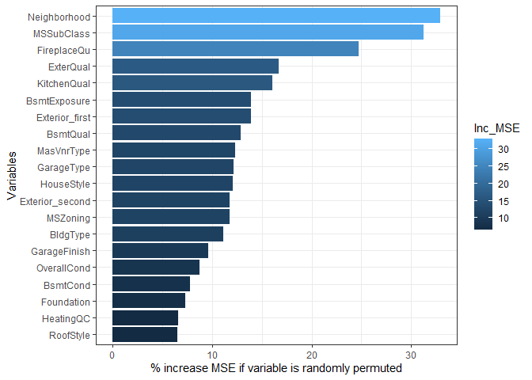

In this plot you can see that "Neighborhood" and "MSSubClass" are the most important categorical variables. Also "FireplaceQu" seems to be quite important, although I think that is just the case, because all the other numeric feature were not included here. I think that "Neighborhood" might also matter in terms of other numeric predictors. That is one aspect I am going to focus on in the following steps.

Also, some variables used in this model, actually have no or even a negative impact if they are included. These are:

``` r
# variables with 0 or negative impact
cat_importance %>%
  filter(Inc_MSE <= 0)
```

    ## # A tibble: 4 x 2
    ##   Variable      Inc_MSE
    ##   <chr>           <dbl>
    ## 1 Utilities       0    
    ## 2 Functional     -0.236
    ## 3 Heating        -0.808
    ## 4 Condition_two  -1.54

At this point I am only going to drop "Utilities" and "Condition\_two", because they won't improve the model performance both from this data/model driven as well as from a theoretical point of view. That is also due to the fact there is very little variation in these variables.

``` r
# drop redundant variables
all_data <- all_data %>%
  select(-c("Utilities", "Condition_two"))
```

### 3.2.2 Neighborhood feature

The feature "Neighborhood" is the most important categorical feature, which makes sense. There is a lot of hidden information in that feature such as the location within the city or the average quality of houses in that area. On the other hand this feature might also be very useful to give even more information about other features such as "totalSF" or "LotArea". E.g. one square feet living area might cost more in district A then in district B. Let's check this out by performing two different regression models.

``` r
# check impact of including interaction effects of Neighborhood with area features
fm1 <- formula(log_price ~ Neighborhood + MSSubClass + OverallQual + totalSF + LotArea )
fm2 <- formula(log_price ~ Neighborhood + MSSubClass + OverallQual + totalSF + LotArea +
                 Neighborhood:(totalSF + LotArea))

fit1 <- lm(fm1, data = filter(all_data, !is.na(log_price)))
fit2 <- lm(fm2, data = filter(all_data, !is.na(log_price)))

summary(fit1)$adj.r.squared
```

    ## [1] 0.8536007

``` r
summary(fit2)$adj.r.squared
```

    ## [1] 0.8715085

You can see an increase of adjusted R squared by roughly 0.02 when the interaction effects are included. Hence, a decrease in RMSE when including those could also be expected.

4. Outlier detection
====================

Before we turn to the modelling process we should check if there are any outliers in the training data that could distort the models. For this purpose multivariate analyses are very helpful. Because of that I am going to create some 3D scatterplots with "totalSF" / "LotArea" and "OverallQual" as predictive variables and of coures "log\_price" as target variable on the z-axis.

``` r
# df for plots
sample_df <- all_data %>%
  filter(!is.na(log_price))
```

``` r
# 3d plot with "totalSF", "OverallQual" and "log_price"
scatter3D(sample_df$totalSF, sample_df$OverallQual, sample_df$log_price,
          phi = 0, pch = 20, cex = 0.5, col="blue",
          main = "Outlier detection", xlab = "Square feet living area",
          ylab = "Quality rating", zlab = "Price")

text3D(sample_df$totalSF, sample_df$OverallQual, sample_df$log_price,
       labels=sample_df$Id, add = TRUE, colkey = FALSE, cex = 0.5)
```

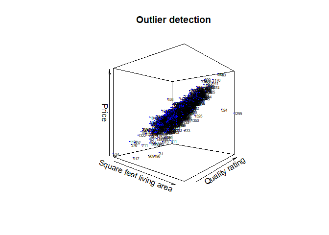

``` r
# 3d plot with "LotArea", "OverallQual" and "log_price"
scatter3D(sample_df$LotArea, sample_df$OverallQual, sample_df$log_price,
          phi = 0, pch = 20, cex = 0.5, col="blue",
          main = "Outlier detection", xlab = "Square feet lot area",
          ylab = "Quality rating", zlab = "Price")

text3D(sample_df$LotArea, sample_df$OverallQual, sample_df$log_price,
       labels=sample_df$Id, add = TRUE, colkey = FALSE, cex = 0.5)
```

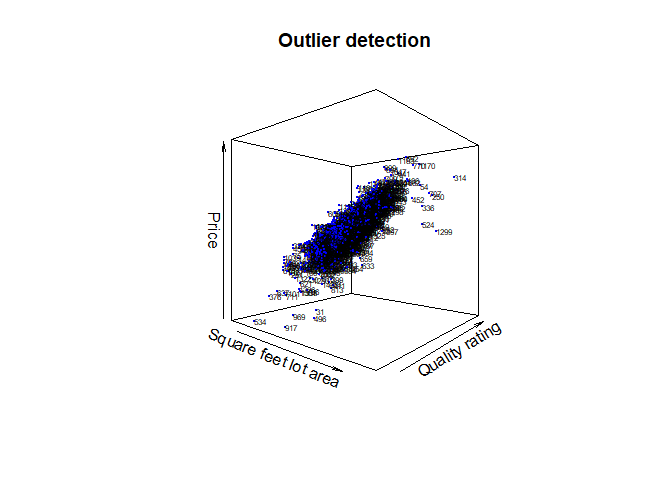

I am going to remove the observations with Id 524 and 1299, since you can see that they are extreme outliers (first plot). When you look at the second plot, where "LotArea" is on the x-Axis, you could argue that there were more observations which should be dropped. However, I don't consider them as outliers, but rather as observations with very large values. They will be kept.

``` r
# remove outliers from data
all_data <- all_data %>%
  filter(!(Id %in% c(524, 1299)))
```

``` r
# How does removing the outliers affect correlation?
totsf_cor1 <- cor(sample_df$totalSF, sample_df$log_price, use="pairwise.complete.obs")
totsf_cor2 <- cor(all_data$totalSF, all_data$log_price, use="pairwise.complete.obs")

lotarea_cor1 <- cor(sample_df$LotArea, sample_df$log_price, use="pairwise.complete.obs")
lotarea_cor2 <- cor(all_data$LotArea, all_data$log_price, use="pairwise.complete.obs")

print(paste0("Increase of correlation between 'totalSF' and 'log_price': ", round(totsf_cor2 - totsf_cor1, 3)))
```

    ## [1] "Increase of correlation between 'totalSF' and 'log_price': 0.015"

``` r
print(paste0("Increase of correlation between 'LotArea' and 'log_price': ", round(lotarea_cor2 - lotarea_cor1, 3)))
```

    ## [1] "Increase of correlation between 'LotArea' and 'log_price': 0.003"

5. Data preparation for the models
==================================

``` r
# convert all chr columns to factor
all_data <- all_data %>%
  mutate_if(is.character, as.factor)
```

``` r
# split dataframe in train and to_predict sets
df_train <- all_data %>%
  filter(!is.na(log_price))

df_predict <- all_data %>%
  filter(is.na(log_price))
```

``` r
### split df_train into train and test sets
set.seed(1234)

# initial split
df_split <- initial_split(df_train, prop = 0.7)

# train and test sets
train <- training(df_split)
test <- testing(df_split)

# save Ids befor dropping them
train_id <- train$Id
test_id <- test$Id

# drop "SalePrice" from train and test data
train <- train %>%
  select(-c("SalePrice", "Id"))
test <- test %>%
  select(-c("SalePrice", "Id"))

# test vector
y_test <- test$log_price
```

6. Models
=========

6.1 Lasso regression
--------------------

The first model I am going to try out is a Lasso regression model. I think that this model is very useful in this scenario since there are heaps of different features. Lasso effectively performs variable selection and thus performs well in terms of the bias variance trade-off and only selecting the important features. There is one hyperparameter (lambda/the penalty term) that needs to be tuned. For that I am going to use a 10-fold cross validation.

``` r
# cross validation sets for training
set.seed(123)

train_cv_folds <- train %>% vfold_cv(v = 10)
```

``` r
# model specification (lasso)
lasso_reg <- linear_reg(penalty = tune(),
           mixture = 1) %>%
  set_engine("glmnet")
```

``` r
# specify grid space (lambda only)
lambda_grid_1 <- grid_regular(penalty(), levels = 50)

# first grid search
set.seed(123)
lasso_stage1_cv <- tune_grid(formula = log_price ~ . + Neighborhood:(totalSF + LotArea + LotFrontage + MasVnrArea + totalPorch + WoodDeckSF),
          model = lasso_reg,
          resamples = train_cv_folds,
          grid = lambda_grid_1,
          metrics = metric_set(rmse))

# 5 best results / settings for lambda
show_best(lasso_stage1_cv, n = 5)
```

Based on the previous results we can specify a new set forlambdas (the penalty term) and make some additional minor improvements.

``` r
# specify grid space (lambda only)
lambda_grid_2 <- grid_regular(penalty(range = c(0.0005, 0.004), trans = NULL), levels = 50)

# second grid search
set.seed(123)
lasso_stage2_cv <- tune_grid(formula = log_price ~ . + Neighborhood:(totalSF + LotArea + LotFrontage + MasVnrArea + totalPorch + WoodDeckSF),
          model = lasso_reg,
          resamples = train_cv_folds,
          grid = lambda_grid_2,
          metrics = metric_set(rmse))
```

    ## Warning: `tune_grid.formula()` is deprecated as of lifecycle 0.1.0.
    ## The first argument to `tune_grid()` should be either a model or a workflow. In the future, you can use:
    ## tune_grid(lasso_reg, log_price ~ . + Neighborhood:(totalSF + 
    ##     LotArea + LotFrontage + MasVnrArea + totalPorch + WoodDeckSF), 
    ##     resamples = train_cv_folds, grid = lambda_grid_2, metrics = metric_set(rmse))
    ## This warning is displayed once every 8 hours.
    ## Call `lifecycle::last_warnings()` to see where this warning was generated.

``` r
# 5 best results / settings for lambda
show_best(lasso_stage2_cv, n = 5)
```

    ## # A tibble: 5 x 7
    ##   penalty .metric .estimator  mean     n std_err .config
    ##     <dbl> <chr>   <chr>      <dbl> <int>   <dbl> <fct>  
    ## 1 0.002   rmse    standard   0.115    10 0.00590 Model22
    ## 2 0.00207 rmse    standard   0.115    10 0.00592 Model23
    ## 3 0.00193 rmse    standard   0.115    10 0.00588 Model21
    ## 4 0.00214 rmse    standard   0.115    10 0.00594 Model24
    ## 5 0.00186 rmse    standard   0.115    10 0.00586 Model20

Update the parameter set again.

``` r
# specify grid space (lambda only)
lambda_grid_3 <- grid_regular(penalty(range = c(0.001, 0.003), trans = NULL), levels = 50)

# second grid search
set.seed(123)
lasso_stage3_cv <- tune_grid(formula = log_price ~ . + Neighborhood:(totalSF + LotArea + LotFrontage + MasVnrArea + totalPorch + WoodDeckSF),
          model = lasso_reg,
          resamples = train_cv_folds,
          grid = lambda_grid_3,
          metrics = metric_set(rmse))
```

    ## Warning: `tune_grid.formula()` is deprecated as of lifecycle 0.1.0.
    ## The first argument to `tune_grid()` should be either a model or a workflow. In the future, you can use:
    ## tune_grid(lasso_reg, log_price ~ . + Neighborhood:(totalSF + 
    ##     LotArea + LotFrontage + MasVnrArea + totalPorch + WoodDeckSF), 
    ##     resamples = train_cv_folds, grid = lambda_grid_3, metrics = metric_set(rmse))
    ## This warning is displayed once every 8 hours.
    ## Call `lifecycle::last_warnings()` to see where this warning was generated.

``` r
# 5 best results / settings for lambda
show_best(lasso_stage3_cv, n = 5)
```

    ## # A tibble: 5 x 7
    ##   penalty .metric .estimator  mean     n std_err .config
    ##     <dbl> <chr>   <chr>      <dbl> <int>   <dbl> <fct>  
    ## 1 0.00202 rmse    standard   0.115    10 0.00591 Model26
    ## 2 0.00198 rmse    standard   0.115    10 0.00590 Model25
    ## 3 0.00206 rmse    standard   0.115    10 0.00592 Model27
    ## 4 0.00194 rmse    standard   0.115    10 0.00589 Model24
    ## 5 0.00210 rmse    standard   0.115    10 0.00593 Model28

It looks like from here no more systematic improvements are possible. We can extract the best lambda value and use it for the final model.

``` r
lasso_stage2_cv %>% select_best()
```

    ## # A tibble: 1 x 2
    ##   penalty .config
    ##     <dbl> <fct>  
    ## 1   0.002 Model22

``` r
# initiate lasso regression model with best lambda
lasso_best <- lasso_reg %>%
  finalize_model(parameters = lasso_stage2_cv %>% select_best())

# fit lasso regression with selected lambda
lasso_final <- lasso_best %>%
  fit(log_price ~ . + Neighborhood:(totalSF + LotArea + LotFrontage + MasVnrArea + totalPorch + WoodDeckSF), data = train)

# make predictions on test set
lasso_pred <- predict(lasso_final, test)

# final evaluation on test data
tibble(true = y_test) %>%
  bind_cols(lasso_pred) %>%
  rmse(true, .pred)
```

    ## # A tibble: 1 x 3
    ##   .metric .estimator .estimate
    ##   <chr>   <chr>          <dbl>
    ## 1 rmse    standard       0.116

It is also helpful to see where, i.e. for which observations the model performs well and for which not that much. For this purpose I am going to plot the real prices of the test data observations against the residuals.

``` r
# diagnostic of model / residuals
diag_p1 <- test %>%
  select(log_price) %>%
  bind_cols(lasso_pred) %>%
  mutate(Id = test_id,
         residuals = log_price - .pred) %>%
  ggplot(aes(x=log_price, y=residuals)) +
  geom_point(position = "jitter") +
  geom_hline(yintercept = 0, col = "red", linetype = "dashed") +
  geom_text(aes(label=Id), hjust=0, vjust=0)

diag_p1
```

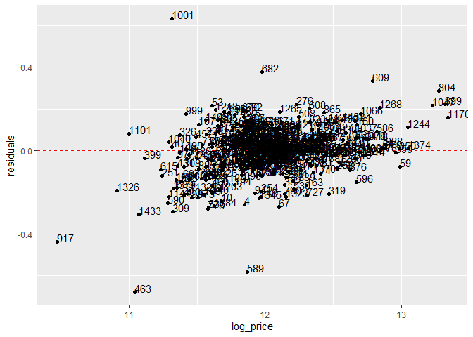

Based on this diagnostic plot we can tell that the model performs relatively poorly when the real prices are either very low or very high.

6.2 Random Forest
-----------------

Random forest is a machine learning technique that works well for lots of typical machine learning tasks. This time we need to initiate a "recipe" and a "workflow" (tidymodels framework) to include the interaction terms.

``` r
# preprocessing recipe for random forest
rf_rec <- recipe(log_price ~ ., data = train) %>%
  step_interact(terms = ~ Neighborhood:(totalSF + LotArea + LotFrontage + MasVnrArea + totalPorch + WoodDeckSF))
```

``` r
rf_prep <- prep(rf_rec)
rf_juiced <- juice(rf_prep)
```

``` r
# initial model sepcification (random forest)
rf_reg <- rand_forest(mtry = tune(),
            trees = tune(),
            min_n = tune()) %>%
  set_mode("regression") %>%
  set_engine("ranger")
```

``` r
# tune workflow
tune_wf <- workflow() %>%
  add_recipe(rf_rec) %>%
  add_model(rf_reg)
```

``` r
# cross validation sets for training
set.seed(123)

train_cv_folds <- train %>% vfold_cv(v = 10)
```

``` r
# parameter set for grid space
rf_param_set1 <- parameters(mtry(range = c(2, 50)), trees(), min_n())

# corresponding grid space
rf_grid_1 <- grid_max_entropy(rf_param_set1, size = 10)
```

The function "grid\_max\_entropy" tries to compute a set of hyperparameter combination such that any portion of the space has one observation in it.

``` r
# first grid search
set.seed(123)
rf_stage1_cv <- tune_grid(tune_wf,
                          resamples = train_cv_folds,
                          grid = rf_grid_1,
                          metrics = metric_set(rmse))

# 10 best results / hyperparameter settings
show_best(rf_stage1_cv, n = 10)
```

In the previous example I explicitly included the interactions between "Neighborhood" and area or size related features. This results in a huge amount of features. However, a non-linear model like a random forest should do well or even better without that specific explication. I am going to test that assumption.

``` r
# first grid search with new model specification
set.seed(123)
rf_cv_red <- tune_grid(formula = log_price ~ .,
                          model = rf_reg,
                          resamples = train_cv_folds,
                          grid = rf_grid_1,
                          metrics = metric_set(rmse))

# 10 best results / hyperparameter settings
show_best(rf_cv_red, n = 10)
```

``` r
### second grid space

 # parameter set for grid space
rf_param_set2 <- parameters(mtry(range = c(10,  60)), trees(range = c(800, 2000)), min_n(range = c(2, 8)))

# corresponding grid space
rf_grid_2 <- grid_max_entropy(rf_param_set2, size = 10)
```

``` r
# second grid search
set.seed(123)
rf_stage2_cv <- tune_grid(formula = log_price ~ .,
                          model = rf_reg,
                          resamples = train_cv_folds,
                          grid = rf_grid_2,
                          metrics = metric_set(rmse))

# 10 best results / hyperparameter settings
show_best(rf_stage2_cv, n = 10)
```

``` r
 ### third grid space

 # parameter set for grid space
rf_param_set3 <- parameters(mtry(range = c(30,  30)), trees(range = c(800, 2000)), min_n(range = c(4, 4)))

# corresponding grid space
rf_grid_3 <- grid_regular(rf_param_set3, levels = 10)
```

``` r
# third grid search
set.seed(123)
rf_stage3_cv <- tune_grid(formula = log_price ~ .,
                          model = rf_reg,
                          resamples = train_cv_folds,
                          grid = rf_grid_3,
                          metrics = metric_set(rmse))
```

    ## Warning: `tune_grid.formula()` is deprecated as of lifecycle 0.1.0.
    ## The first argument to `tune_grid()` should be either a model or a workflow. In the future, you can use:
    ## tune_grid(rf_reg, log_price ~ ., resamples = train_cv_folds, 
    ##     grid = rf_grid_3, metrics = metric_set(rmse))
    ## This warning is displayed once every 8 hours.
    ## Call `lifecycle::last_warnings()` to see where this warning was generated.

``` r
# 10 best results / hyperparameter settings
show_best(rf_stage3_cv, n = 10)
```

    ## # A tibble: 10 x 9
    ##     mtry trees min_n .metric .estimator  mean     n std_err .config
    ##    <int> <int> <int> <chr>   <chr>      <dbl> <int>   <dbl> <fct>  
    ##  1    30   933     4 rmse    standard   0.134    10 0.00578 Model02
    ##  2    30  1600     4 rmse    standard   0.135    10 0.00597 Model07
    ##  3    30  1466     4 rmse    standard   0.135    10 0.00588 Model06
    ##  4    30  1866     4 rmse    standard   0.135    10 0.00593 Model09
    ##  5    30  2000     4 rmse    standard   0.135    10 0.00583 Model10
    ##  6    30  1333     4 rmse    standard   0.135    10 0.00597 Model05
    ##  7    30  1200     4 rmse    standard   0.135    10 0.00587 Model04
    ##  8    30  1733     4 rmse    standard   0.135    10 0.00588 Model08
    ##  9    30  1066     4 rmse    standard   0.135    10 0.00569 Model03
    ## 10    30   800     4 rmse    standard   0.135    10 0.00602 Model01

``` r
rf_stage3_cv %>% select_best()
```

    ## # A tibble: 1 x 4
    ##    mtry trees min_n .config
    ##   <int> <int> <int> <fct>  
    ## 1    30   933     4 Model02

``` r
# initiate random forest with best parameter combination
rf_best <- rf_reg %>%
  finalize_model(parameters = select_best(rf_stage3_cv))

# fit rf with best hyperparameters
rf_final <- rf_best %>%
  fit(log_price ~ ., data = train)

# make predictions on test set
rf_pred <- predict(rf_final, test)

# final evaluation on test data
tibble(true = y_test) %>%
  bind_cols(rf_pred) %>%
  rmse(true, .pred)
```

    ## # A tibble: 1 x 3
    ##   .metric .estimator .estimate
    ##   <chr>   <chr>          <dbl>
    ## 1 rmse    standard       0.123

``` r
# diagnostic of residuals
diag_p2 <- test %>%
  select(log_price) %>%
  bind_cols(rf_pred) %>%
  mutate(Id = test_id,
         residuals = log_price - .pred) %>%
  ggplot(aes(x=log_price, y=residuals)) +
  geom_point(position = "jitter") +
  geom_hline(yintercept = 0, col = "red", linetype = "dashed") +
  geom_text(aes(label=Id), hjust=0, vjust=0)

# comparison with first model
grid.arrange(diag_p1, diag_p2, nrow = 2)
```

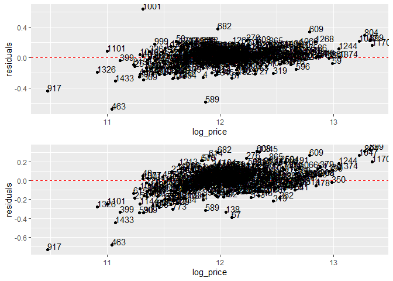

The performance of the random forest model is not as good as the one of the lasso model.

6.3 XgBoost Regression
----------------------

One more popular machine learning technique is the XGBoost algorithm. It is a combination of lots of weak learners (decision trees) which all together make up one very strong learner. It has proven to work very well and lots of kaggle competitions have been won using this algorithm.

``` r
# initial xgboost model
xgboost_reg <- boost_tree(mtry = tune(),
           trees = tune(),
           min_n = tune(),
           tree_depth = tune(),
           learn_rate = tune(),
           loss_reduction = tune()) %>%
  set_mode("regression") %>%
  set_engine("xgboost", objective = "reg:squarederror")
```

``` r
# parameter set for xgboost
xgboost_params_1 <- parameters(mtry(range = c(20, 40)), trees(), min_n(), tree_depth(), learn_rate(), loss_reduction())

# corresponding grid space
xgboost_grid_1 <- grid_max_entropy(xgboost_params_1, size = 10)
```

``` r
# cross validation sets for training
set.seed(123)

train_cv_folds <- train %>% vfold_cv(v = 10)
```

``` r
# first xgboost grid search
set.seed(123)
xgboost_stage1_cv <- tune_grid(formula = log_price ~ .,
                               model = xgboost_reg,
                               resamples = train_cv_folds,
                               grid = xgboost_grid_1,
                               metrics = metric_set(rmse))

# 5 best results
show_best(xgboost_stage1_cv, n = 5)
```

``` r
# second parameter set for xgboost
xgboost_params_2 <- parameters(mtry(range = c(30, 50)),
                               trees(range = c(1800, 2000)),
                               min_n(range = c(20, 40)),
                               tree_depth(range = c(5, 20)),
                               learn_rate(range = c(0.01, 0.1), trans = NULL),
                               loss_reduction())

# corresponding grid space
xgboost_grid_2 <- grid_max_entropy(xgboost_params_2, size = 10)
```

``` r
# second xgboost grid search
set.seed(123)
xgboost_stage2_cv <- tune_grid(formula = log_price ~ .,
                               model = xgboost_reg,
                               resamples = train_cv_folds,
                               grid = xgboost_grid_2,
                               metrics = metric_set(rmse))

# 5 best results
show_best(xgboost_stage2_cv, n = 5)
```

``` r
# third parameter set for xgboost
xgboost_params_3 <- parameters(mtry(range = c(40, 40)),
                               trees(range = c(1930, 1930)),
                               min_n(range = c(20, 35)),
                               tree_depth(range = c(10, 15)),
                               learn_rate(range = c(0.005, 0.07), trans = NULL),
                               loss_reduction())

# corresponding grid space
xgboost_grid_3 <- grid_max_entropy(xgboost_params_3, size = 30)
```

``` r
# third xgboost grid search
set.seed(123)
xgboost_stage3_cv <- tune_grid(formula = log_price ~ .,
                               model = xgboost_reg,
                               resamples = train_cv_folds,
                               grid = xgboost_grid_3,
                               metrics = metric_set(rmse))

# 5 best results
show_best(xgboost_stage3_cv, n = 5)
```

``` r
# fourth parameter set for xgboost
xgboost_params_4 <- parameters(mtry(range = c(40, 40)),
                               trees(range = c(1930, 1930)),
                               min_n(range = c(20, 20)),
                               tree_depth(range = c(13, 13)),
                               learn_rate(range = c(0.005, 0.01), trans = NULL),
                               loss_reduction())

# corresponding grid space
xgboost_grid_4 <- grid_max_entropy(xgboost_params_4, size = 10)
```

``` r
# fourth xgboost grid search
set.seed(123)
xgboost_stage4_cv <- tune_grid(formula = log_price ~ .,
                               model = xgboost_reg,
                               resamples = train_cv_folds,
                               grid = xgboost_grid_4,
                               metrics = metric_set(rmse))
```

    ## Warning: `tune_grid.formula()` is deprecated as of lifecycle 0.1.0.
    ## The first argument to `tune_grid()` should be either a model or a workflow. In the future, you can use:
    ## tune_grid(xgboost_reg, log_price ~ ., resamples = train_cv_folds, 
    ##     grid = xgboost_grid_4, metrics = metric_set(rmse))
    ## This warning is displayed once every 8 hours.
    ## Call `lifecycle::last_warnings()` to see where this warning was generated.

``` r
# 5 best results
show_best(xgboost_stage4_cv, n = 5)
```

    ## # A tibble: 5 x 12
    ##    mtry trees min_n tree_depth learn_rate loss_reduction .metric .estimator
    ##   <int> <int> <int>      <int>      <dbl>          <dbl> <chr>   <chr>     
    ## 1    40  1930    20         13    0.00949 0.000000000347 rmse    standard  
    ## 2    40  1930    20         13    0.00865 0.000655       rmse    standard  
    ## 3    40  1930    20         13    0.00999 0.000000000132 rmse    standard  
    ## 4    40  1930    20         13    0.00658 0.00000295     rmse    standard  
    ## 5    40  1930    20         13    0.00760 0.0289         rmse    standard  
    ## # ... with 4 more variables: mean <dbl>, n <int>, std_err <dbl>, .config <fct>

``` r
# initiate xgboost with best parameter combination
xgboost_best <- xgboost_reg %>%
  finalize_model(parameters = select_best(xgboost_stage4_cv))

# fit rf with best hyperparameters
xgboost_final <- xgboost_best %>%
  fit(log_price ~ ., data = train)

# make predictions on test set
xgboost_pred <- predict(xgboost_final, test)

# final evaluation on test data
tibble(true = y_test) %>%
  bind_cols(xgboost_pred) %>%
  rmse(true, .pred)
```

    ## # A tibble: 1 x 3
    ##   .metric .estimator .estimate
    ##   <chr>   <chr>          <dbl>
    ## 1 rmse    standard       0.116

The root mean square error is even lower than the one we have gotten by the lasso model.

``` r
# diagnostic of model / residuals
diag_p3 <- test %>%
  select(log_price) %>%
  bind_cols(xgboost_pred) %>%
  mutate(Id = test_id,
         residuals = log_price - .pred) %>%
  ggplot(aes(x=log_price, y=residuals)) +
  geom_point(position = "jitter") +
  geom_hline(yintercept = 0, col = "red", linetype = "dashed") +
  geom_text(aes(label=Id), hjust=0, vjust=0)

# comparison with first model
grid.arrange(diag_p1, diag_p3, nrow = 2)
```

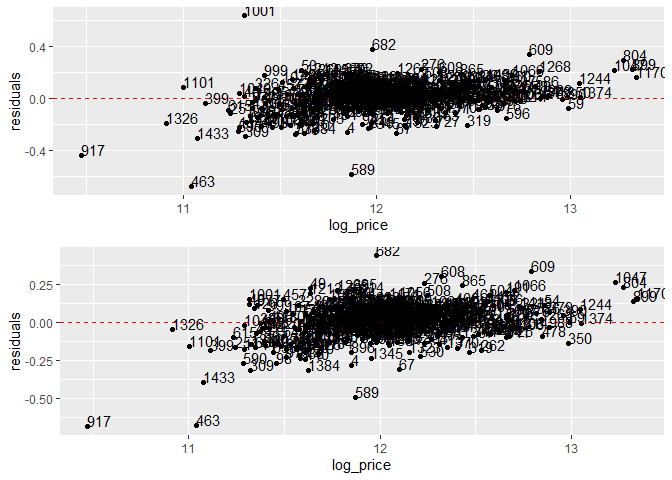

The XGBoost model does better in terms of not overestimating the price of houses. On the other hand it sometimes tends to underestimate the house prices, especially when compared to the lasso model.

6.4 Stacked Model
-----------------

In this competition lots of people could improve their score by "stacking up" models, i.e. combining and averaging their predictions. I am going to try that out, too.

``` r
# average predictions from two best models / rmse
tibble(true = y_test) %>%
  bind_cols(lasso_pred, xgboost_pred) %>%
  rename(lasso = ".pred...2",
         xgboost = ".pred...3") %>%
  mutate(stacked = (lasso + xgboost)/2) %>%
  rmse(true, stacked)
```

    ## New names:
    ## * .pred -> .pred...2
    ## * .pred -> .pred...3

    ## # A tibble: 1 x 3
    ##   .metric .estimator .estimate
    ##   <chr>   <chr>          <dbl>
    ## 1 rmse    standard       0.111

Averaging the predictions from both models decreases the rmse again.

``` r
# diagnostic of stacked model / residuals
diag_p4 <- test %>%
  select(log_price) %>%
  bind_cols(lasso_pred, xgboost_pred)%>%
  rename(lasso = ".pred...2",
         xgboost = ".pred...3") %>%
  mutate(stacked = (lasso + xgboost)/2) %>%
  mutate(Id = test_id,
         residuals = log_price - stacked) %>%
  ggplot(aes(x=log_price, y=residuals)) +
  geom_point(position = "jitter") +
  geom_hline(yintercept = 0, col = "red", linetype = "dashed") +
  geom_text(aes(label=Id), hjust=0, vjust=0)
```

    ## New names:
    ## * .pred -> .pred...2
    ## * .pred -> .pred...3

``` r
# comparison with first model
grid.arrange(diag_p1, diag_p3, diag_p4, nrow = 3)
```

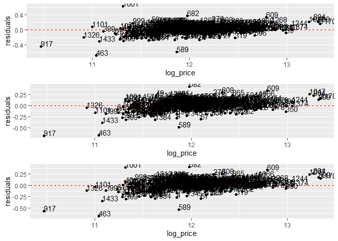

7. Final Model and submission
=============================

7.1 Lasso
---------

``` r
# fit lasso model on entire data
lasso_final <- lasso_best %>%
  fit(log_price ~ . + Neighborhood:(totalSF + LotArea + LotFrontage + MasVnrArea + totalPorch + WoodDeckSF),
      data = (df_train %>% select(-c("Id", "SalePrice"))))
              
# make predictions on evaluation set
submission_lasso <- predict(lasso_final, df_predict)
```

``` r
sub_lasso <- tibble(Id = df_predict$Id) %>%
  bind_cols(submission_lasso) %>%
  rename(SalePrice = ".pred") %>%
  mutate(SalePrice = exp(SalePrice))
```

``` r
write_csv(sub_lasso, path = path1)
```

7.2 XGBoost
-----------

``` r
# fit xgboost model on entire data
xgboost_final <- xgboost_best %>%
  fit(log_price ~ .,
      data = (df_train %>% select(-c("Id", "SalePrice"))))
              
# make predictions on evaluation set
submission_xgb <- predict(xgboost_final, df_predict)
```

``` r
sub_xgb <- tibble(Id = df_predict$Id) %>%
  bind_cols(submission_xgb) %>%
  rename(SalePrice = ".pred") %>%
  mutate(SalePrice = exp(SalePrice))
```

``` r
write_csv(sub_xgb, path = path2)
```

7.3 Stacked Model
-----------------

``` r
sub_stacked <- sub_lasso %>%
  mutate(SalePrice = (sub_lasso$SalePrice + sub_xgb$SalePrice)/2)
```

``` r
write_csv(sub_stacked, path = path3)
```
